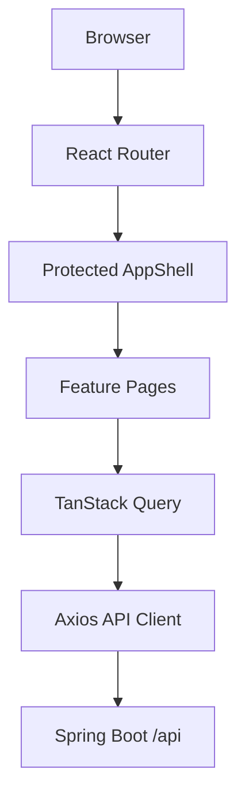
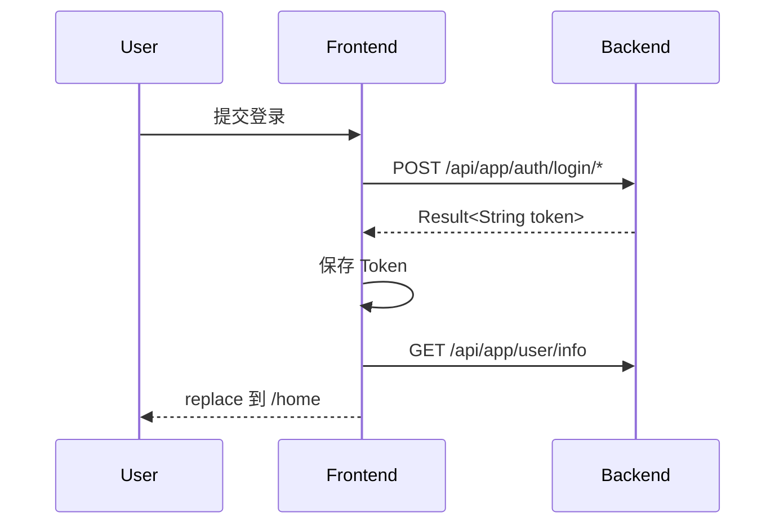

# HomeWork 前端工程设计文档

> 文档版本：V1.0  
> 编写日期：2026-07-25  
> 当前阶段：后端核心功能已开发，前端尚未开始  
> 适用范围：HomeWork 用户端 Web 前端

## 1. 设计结论

HomeWork 前端采用单页应用架构：

```text
React 19 + TypeScript + Vite
React Router Data Mode
TanStack Query
Tailwind CSS + shadcn/ui
```

整体延续交互原型的温暖、克制、卡片式视觉风格，但不直接复制原型代码和模拟数据。原型负责表达页面层级和业务流程，后端代码负责定义真实业务。

本项目遵循以下原则：

1. 后端 Controller、DTO、VO、枚举和 Service 业务规则是前端实现的唯一业务真相。
2. 原型与后端不一致时，以后端为准。
3. 原型中存在、但后端没有接口支持的功能不进入 V1，不制作无法使用的空入口。
4. 页面追求清晰、安静和易用，不堆叠装饰、入口或重复信息。
5. 服务端数据由 TanStack Query 管理，不再复制到全局状态库。
6. 第一阶段不引入 Redux、Zustand、MUI、微前端、SSR 或自建组件框架。
7. 登录后的全部页面共享同一个 `AppShell`，导航栏在答题、考试、成绩、会员和消息页面中也不会消失。

## 2. 设计依据与优先级

发生设计冲突时，按照以下优先级处理：

```text
Controller 接口
  ↓
DTO / VO / 枚举
  ↓
Service 业务规则
  ↓
数据库结构与迁移脚本
  ↓
交互原型
```

前端不得：

- 根据原型模拟后端未返回的数据。
- 硬编码会员价格、会员权益状态或订单结果。
- 自己推断题目正确答案。
- 自己计算服务端已经返回的互动计数。
- 因为原型中存在某个入口，就创建一个没有后端能力的空页面。

## 3. V1 产品范围

### 3.1 V1 包含

- 邮箱注册、邮箱登录和第三方 OAuth 登录。
- 登录后默认进入首页。
- 全局导航、用户信息、会员标识和未读消息提示。
- 首页热门面试题库前 5、热门认证题库前 5、最新 Hit 前 10。
- 面试题库分类、排序和答题流程。
- 认证题库分类、练习模式、考试模式、成绩与答案回顾。
- 题目收藏、错题、笔记、答题记录和 AI 追问。
- Hit 发布、评论、回复、点赞、收藏和转发。
- 用户中心、公开用户主页、关注和私信。
- 四类消息页。
- Premium / Premium Plus 会员中心、购买、补差升级、支付状态和订单历史。
- 学习心跳和年度学习日历。

### 3.2 V1 不包含

以下能力在原型中出现，但当前后端没有完整接口，因此不进入 V1：

- Settings 页面和用户资料修改。
- 反馈与建议。
- 独立的“我的题库”收藏体系。
- 每周学习柱状图和每日错题率趋势图。
- Hit 编辑、删除、举报和图片上传。
- 题目纠错提交。
- 单条 Hit 的独立详情接口与可刷新深链接。
- WebSocket 实时通知。
- 深色模式。
- 管理后台。

后端补充对应接口后，再把这些功能加入新的迭代，不提前建立复杂占位结构。

## 4. 技术栈

### 4.1 核心技术

| 技术 | 用途 | 选择理由 |
| --- | --- | --- |
| React 19 | UI 组件与页面渲染 | 原型已经使用 React，可延续设计思路 |
| TypeScript | 类型约束 | DTO、VO 和数字枚举较多，需要编译期校验 |
| Vite | 开发与构建 | 配置轻、开发反馈快，适合独立 SPA |
| React Router 7 Data Mode | 路由、嵌套布局、路由守卫、懒加载 | 支持统一 `AppShell` 和可恢复 URL |
| TanStack Query 5 | 接口请求、缓存、失效和请求状态 | 服务端数据不需要再放入全局 Store |
| Axios | HTTP 客户端 | 统一处理 Bearer Token 和业务响应码 |
| Tailwind CSS 4 | 页面样式 | 可直接表达原型中的间距和响应式布局 |
| shadcn/ui | 基础交互组件 | 组件源码属于项目，容易控制视觉，不形成黑盒依赖 |
| Lucide React | 图标 | 与原型一致，风格简洁统一 |
| React Hook Form + Zod | 登录、注册和内容表单 | 表单状态与客户端校验职责清晰 |
| date-fns | 时间显示 | 处理相对时间、到期时间和学习日历 |
| qrcode.react | 微信支付二维码 | 将后端 `codeUrl` 渲染为二维码 |
| Sonner | Toast | 统一成功、失败和轻提示 |

参考官方文档：

- [React](https://react.dev/versions)
- [Vite](https://vite.dev/guide/)
- [React Router](https://reactrouter.com/start/modes)
- [TanStack Query](https://tanstack.com/query/latest/docs/framework/react/overview)
- [Tailwind CSS](https://tailwindcss.com/docs/installation)
- [shadcn/ui](https://ui.shadcn.com/docs/installation)

### 4.2 测试与工程质量

| 技术 | 用途 |
| --- | --- |
| Vitest | 工具函数、Hook 和组件测试 |
| React Testing Library | 按用户行为测试页面 |
| MSW | 在测试环境模拟后端响应 |
| Playwright | 登录、答题、发 Hit、会员支付等关键链路 |
| ESLint | 代码规则 |
| Prettier | 格式统一 |

### 4.3 明确不使用

- 不同时使用 MUI 和 shadcn/ui。
- 不一次性安装全部 shadcn/ui 组件，只添加实际使用的组件。
- 不为接口缓存引入 Redux 或 Zustand。
- 不为简单过渡动画引入 Motion，优先使用 CSS transition。
- 后端没有统计图接口前，不引入 Recharts。

依赖使用 `pnpm` 管理，并提交 `pnpm-lock.yaml`。`package.json` 使用明确的版本范围，锁文件固定实际安装版本。

## 5. 前端总体架构



职责划分：

- Router：负责 URL、鉴权边界、页面懒加载和 404。
- AppShell：负责固定导航、用户信息、会员标识、未读消息和学习心跳。
- Feature：负责某一个业务域的页面、组件、请求和类型。
- TanStack Query：负责服务端数据及请求状态。
- 本地 React State：负责弹窗、输入框、当前展开项等短期 UI 状态。
- URL Search Params：负责消息 Tab、题库筛选和可被刷新恢复的页面状态。

React Router 的 Loader 只用于路由级鉴权判断、重定向和懒加载，不在 Loader 和 TanStack Query 中重复请求同一份业务数据。页面业务数据统一通过 TanStack Query 获取。

## 6. 推荐目录结构

```text
homework-frontend/
├── public/
├── src/
│   ├── app/
│   │   ├── App.tsx
│   │   ├── router.tsx
│   │   ├── providers.tsx
│   │   └── query-client.ts
│   ├── layouts/
│   │   ├── AppShell.tsx
│   │   ├── DesktopHeader.tsx
│   │   ├── MobileHeader.tsx
│   │   └── MobileBottomNav.tsx
│   ├── features/
│   │   ├── auth/
│   │   ├── home/
│   │   ├── question-bank/
│   │   ├── interview/
│   │   ├── certificate/
│   │   ├── hit/
│   │   ├── user-center/
│   │   ├── user-profile/
│   │   ├── messages/
│   │   ├── membership/
│   │   └── learning-activity/
│   ├── shared/
│   │   ├── api/
│   │   │   ├── client.ts
│   │   │   ├── result.ts
│   │   │   └── errors.ts
│   │   ├── components/
│   │   ├── hooks/
│   │   ├── lib/
│   │   ├── types/
│   │   └── ui/
│   ├── styles/
│   │   ├── globals.css
│   │   └── tokens.css
│   ├── main.tsx
│   └── vite-env.d.ts
├── tests/
│   └── e2e/
├── .env.example
├── components.json
├── vite.config.ts
└── package.json
```

每个 Feature 最多包含：

```text
api.ts
queries.ts
types.ts
components/
pages/
```

不建立无实际价值的 `repository`、`manager`、`model` 等多层包装。页面不直接拼接 URL，请求统一放在 Feature 的 `api.ts` 中。

## 7. 路由设计

### 7.1 公共路由

| 路由 | 页面 |
| --- | --- |
| `/login` | 邮箱和 OAuth 登录 |
| `/register` | 邮箱注册 |
| `/oauth/callback/:provider` | 第三方登录回调 |

登录、注册和 OAuth 回调页不显示登录后的用户导航。

### 7.2 登录后路由

| 路由 | 页面 |
| --- | --- |
| `/` | 重定向到 `/home` |
| `/home` | 首页 |
| `/banks/interview` | 面试题库 |
| `/banks/certification` | 认证题库 |
| `/banks/interview/:bankId/practice` | 面试答题 |
| `/banks/certification/:bankId/practice` | 认证练习 |
| `/banks/certification/exams/:sessionId` | 认证考试 |
| `/banks/:groupType/:bankId/review` | 题库回顾 |
| `/hits` | 最新 Hit |
| `/me` | 当前用户个人中心 |
| `/me/wrong-questions` | 错题本 |
| `/me/favorites` | 题目收藏 |
| `/me/notes` | 我的笔记 |
| `/users/:userId` | 公开用户主页 |
| `/messages` | 我的消息 |
| `/membership` | 会员购买页 |
| `/membership/center` | 当前会员信息 |
| `/membership/orders` | 订单历史 |
| `/membership/orders/:orderNo` | 支付状态页 |

所有登录后路由嵌套在 `AppShell` 下：

```text
ProtectedRoute
└── AppShell
    ├── Persistent Navigation
    └── Outlet
```

登录或注册成功后：

```ts
navigate("/home", { replace: true });
```

使用 `replace` 避免用户点击浏览器返回键后重新进入登录页。

## 8. 导航与响应式设计

### 8.1 桌面端

桌面端顶部导航固定在视口顶部，高度为 64px：

```text
Logo
首页
面试题库
认证题库
#Hit
个人中心
                           消息 / 头像 / 姓名 / Membership
```

规则：

- 当前路由对应的导航项保持高亮。
- 页面内容统一设置顶部安全间距，不允许被固定导航遮挡。
- 答题页、考试页和成绩页仍然使用相同导航。
- 头像菜单通过点击或键盘焦点打开，不只依赖 hover。
- 点击页面外部或按 Escape 关闭菜单。

头像菜单 V1 只显示后端已经支持的入口：

- 个人中心
- 会员中心
- 我的消息
- 订单历史
- 退出登录

不显示 Settings 和反馈与建议。

`AppShell` 启动后并行获取：

```text
GET /api/app/user/info
GET /api/app/membership/center
GET /api/app/messages/unread-summary
```

三类数据分别缓存，任一请求刷新时不阻塞整个页面。用户信息尚未返回时使用固定尺寸头像 Skeleton，避免导航左右抖动。

### 8.2 移动端

小于 768px 时：

- 顶部固定区保留 Logo、页面标题、头像和会员标识。
- 五个主导航放在底部固定导航中。
- 页面主体同时预留顶部和底部安全区域。
- 答题页的题号导航改为可展开抽屉。
- AI 追问使用全屏 Sheet，不固定占用右侧宽度。

底部导航仍属于全局导航，因此“导航永远存在”的产品要求不变。

### 8.3 断点

```text
mobile:  < 768px
tablet:  768px - 1199px
desktop: >= 1200px
```

桌面内容最大宽度建议为 1200px；Hit、消息和会员等阅读型页面使用 680px～760px 的窄内容区。

## 9. 视觉系统

### 9.1 风格

保留原型的暖灰背景、低饱和棕色主色、柔和绿色辅助色和圆角卡片。视觉重点放在内容与状态，不使用大面积渐变、强阴影或过多动画。

建议基础色：

```css
:root {
  --background: #f5f1ec;
  --surface: #fffdfb;
  --foreground: #2f2925;
  --muted-foreground: #6f655e;
  --primary: #80685f;
  --primary-foreground: #ffffff;
  --secondary: #627d79;
  --premium: #a87924;
  --success: #4f7f72;
  --warning: #a66f21;
  --danger: #b55353;
  --border: #ded5ce;
}
```

实现时需要使用自动化工具检查文字和背景对比度，普通正文至少满足 WCAG AA。

### 9.2 字体

```css
font-family:
  Inter,
  "PingFang SC",
  "Microsoft YaHei",
  system-ui,
  sans-serif;
```

中文标题不依赖外部衬线字体。品牌英文可以局部使用衬线字体，但不得造成首屏字体阻塞。

### 9.3 空间与组件

- 使用 8px 间距基准。
- 卡片圆角 12px～16px。
- 普通阴影只用于下拉菜单、Dialog 和浮层。
- 一个卡片或区域最多保留一个主操作。
- 按钮文案使用“开始答题”“提交答案”“立即支付”等明确动词。
- Loading 使用与最终布局一致的 Skeleton。
- 空状态只包含一句解释和一个必要操作。
- 服务异常提供“重新加载”，不展示技术堆栈。

### 9.4 数据展示约定

- `avgCorrectRate === null` 时显示 `--`，不能显示为 `0%`。
- 计数统一使用中文紧凑格式，例如 `1.2万`。
- 时间线显示相对时间，Hover 或详情显示完整时间。
- Membership 枚举统一转换为中文展示，不直接显示数字。
- 用户头像为空时显示昵称首字符。
- 后端返回“该用户已注销”时使用默认头像，不再发起用户详情请求。

## 10. 页面设计

### 10.1 登录与注册

页面使用单列居中卡片，不显示业务导航。

邮箱登录字段：

- 邮箱
- 密码
- Cloudflare Turnstile

邮箱注册字段：

- 昵称
- 邮箱
- 密码
- 确认密码
- Cloudflare Turnstile

第三方登录入口根据实际配置显示 Google、Apple、微信和 QQ。未配置 Client ID 或回调地址的 Provider 不显示。

后端登录成功只返回 Token。前端处理顺序：



### 10.2 首页

首页只请求一次：

```text
GET /api/app/home-page
```

页面结构：

1. 简短欢迎区。
2. 热门面试题库，最多 5 条。
3. 热门认证题库，最多 5 条。
4. 最新 Hit，最多 10 条。

桌面端两个题库模块左右排列，移动端上下排列。每条题库展示：

- 题库名称
- 所属一级模块
- 完成人数 `completeCount`
- 平均正确率 `avgCorrectRate`

点击面试题库直接进入面试答题页。点击认证题库先打开“练习模式 / 考试模式”选择 Dialog。

最新 Hit 模块右侧显示“查看更多”，跳转到 `/hits`。页面和组件中不再使用“热门 Hit”文案，因为当前后端按创建时间倒序返回。

### 10.3 面试题库与认证题库

两类题库复用同一个页面骨架：

```text
一级模块卡片
  ↓
左侧二级分类
  ↓
右侧题库列表
```

面试题库使用当前数据库 Group ID `1`，认证题库使用 Group ID `2`。由于当前后端没有 Group 列表接口，这两个 ID 作为集中常量保存：

```ts
export const QUESTION_BANK_GROUP_ID = {
  INTERVIEW: 1,
  CERTIFICATION: 2,
} as const;
```

不得在多个组件中散落数字 `1` 和 `2`。

进入页面时调用 `/group-page`，使用后端返回的 `firstModule`、`firstSubModule` 和默认 `sort` 初始化选中状态。

点击已经选中的 Module 或 SubModule 时，前端直接返回，不重复请求。后端在重复选择时可能返回 `data: null`，UI 不应依赖这个行为完成切换。

题库行展示：

- 题库名称
- 题目数量
- 完成人数
- 平均正确率
- 标签
- “开始答题”操作

排序只提供：

- 热度：`SortType.HOT = 1`
- 最新：`SortType.LATEST = 2`

选中的 `moduleId`、`subModuleId` 和 `sort` 写入 URL Search Params，使刷新后可以恢复。

### 10.4 面试答题

桌面布局延续原型的三栏结构：

```text
题号导航 | 题目与作答区 | AI 评分、参考答案与笔记
```

核心行为：

- 进入页面后一次性获取题库问题。
- 当前题号写入 `?question={id}`。
- 未提交答案前，右侧只显示简洁提示。
- 提交后按照后端返回值展示分析、AI 结果、参考答案和收藏状态。
- `aiEvaluationEnabled=false` 时不伪造 AI 分数，显示会员能力说明。
- 收藏按钮调用真实收藏接口。
- 笔记提交成功后显示轻量 Toast。
- 离开仍有未提交文本的页面时进行一次确认。
- 完成题库时调用 `/finish`，不能只在前端计算完成状态。

移动端按顺序显示：

```text
题目
作答输入
提交操作
评分与解析
笔记
```

题号列表放入抽屉。

### 10.5 认证练习

认证题库点击后先选择模式。

练习模式：

- 一次性拉取题目。
- 单选和多选组件由 `questionType` 决定。
- 提交某题后，由后端返回 `correctAnswer`、`correct` 和 `analysis`。
- 提交后锁定当前选择，用户主动进入下一题。
- 完成题库时调用 `/finish`。

前端不得把正确答案放入初始题目状态。

### 10.6 认证考试

考试开始：

```text
POST /api/app/bank/certificate/exams/start?bankId={id}
```

后端会创建或恢复进行中的考试，前端随后使用 `sessionId` 进入考试路由。

考试规则：

- 倒计时以服务端 `expiresAt` 为准。
- 页面刷新后调用 `GET /exams/{sessionId}` 恢复。
- 用户每次选择或取消选项后调用 `/answer` 保存。
- 保存请求未完成时，不允许同一道题并发提交多个旧状态。
- 提交试卷前显示确认 Dialog。
- 到达 `expiresAt` 时只触发一次提交。
- 收到业务码 `514` 时显示“考试已到期”，进入后端返回或允许恢复的结果状态。
- 成绩和正确答案只使用 `/submit` 返回的 `BankFinishVO`。

浏览器关闭、刷新或切换路由不会丢失已经保存到后端的答案。

### 10.7 AI 追问

AI 会话以 `userId + bankId` 为维度复用：

- 打开面板先调用 `GET /ai/chat`。
- 发送追问调用 `POST /ai/chat`。
- 离开题库答题流程时调用 `POST /ai/chat/close`。

桌面端使用右侧 Sheet，移动端使用全屏 Sheet。消息列表只渲染纯文本并保留换行，不使用 `dangerouslySetInnerHTML`。

### 10.8 最新 Hit

页面标题使用：

```text
#Hit · 学习动态
```

顶部发布器保持简洁：

- 140 个 Unicode 字符。
- 正文中的 `#标签` 由后端提取。
- `@用户` 使用 `/api/app/users/search` 返回的稳定用户 ID。
- 不单独提供重复的 Tags 输入框。
- 不提供图片上传。

时间线按最新到最旧显示，每页 20 条，使用“加载更多”而不是自动无限滚动。因为接口不返回 `total` 或 `hasNext`，当返回数量小于 `pageSize` 时停止加载。

互动操作：

- 点赞、收藏和转发按钮在请求期间禁用。
- 成功后使用后端 `HitActionResultVO` 更新当前卡片。
- V1 不做复杂乐观更新，避免请求失败造成计数回滚问题。
- 评论在卡片内展开，不建立依赖单条 Hit 接口的独立详情页。

评论按时间正序显示，使用“加载更多评论”。回复只保存 `parentCommentId`，视觉上最多使用一级缩进，避免无限嵌套。

### 10.9 当前用户个人中心

个人中心顶部展示：

- 头像、昵称和会员标识。
- 粉丝数、关注数和发帖数。
- 累计作答题目、学习题库和学习时长。

快捷入口只保留：

- 错题本
- 题目收藏
- 我的笔记

不显示原型中的独立“我的题库”。

页面下方展示后端支持的年度学习日历。颜色等级：

```text
无数据       灰色
0 分钟       最浅绿色
1～30 分钟   浅绿色
31～60 分钟  中浅绿色
61～120 分钟 中绿色
>120 分钟    深绿色
```

不展示没有接口支持的周学习柱状图和错题率折线图。

### 10.10 公开用户主页

路由为 `/users/:userId`，包含：

- 用户和会员信息。
- 关注、粉丝、Post、作答、题库、学习时长和收到的互动数量。
- 关注/取消关注。
- 私信入口。
- Posts、Commented、Liked、Favorite 四类活动。

活动接口不返回总数，使用“加载更多”。点击用户自己的主页时，可以显示“进入个人中心”，不显示关注按钮。

当前没有单条 Hit 详情接口，因此通知或活动中的 Post 深链接只在当前已加载数据能够定位时启用；完整深链接功能等待后端补充接口。

### 10.11 我的消息

页面使用四个 Tab：

| UI 名称 | 请求参数 |
| --- | --- |
| 评论和@ | `comments` |
| 赞、收藏和转发 | `interactions` |
| 系统消息 | `system` |
| 私信 | 独立会话接口 |

Tab 状态写入 URL：

```text
/messages?tab=comments
/messages?tab=interactions
/messages?tab=system
/messages?tab=private&chatboxId=123
```

进入前三类通知 Tab 时使用 `PUT /notifications/open-tab`，该操作会把当前未读通知批量设为已读。用户主动点击“查看历史信息”时才调用只读历史接口。

私信页面：

- 左侧或首屏显示会话列表。
- 右侧或下一屏显示聊天窗口。
- 打开会话不自动把全部消息设为已读。
- 用户点击收到的某条私信时，调用单条已读接口。
- `canCurrentUserSend=false` 时禁用输入框，并解释需要等待对方回复。
- 私信只支持文本。

### 10.12 会员与支付

会员页面完全使用当前后端模型，不使用旧原型中的“面试 Premium / 认证 Premium”拆分。

会员等级：

- Premium
- Premium Plus

购买类型：

- 全款购买
- 补差升级

页面初始化调用：

```text
GET /api/app/membership
```

价格、币种、购买月份和可升级范围全部使用 `MembershipDetailPageVO`，禁止硬编码。

创建订单：

1. 用户点击某个 SKU。
2. 前端为本次购买意图生成 `crypto.randomUUID()`。
3. 使用该值作为 `Idempotency-Key`。
4. 网络重试必须复用同一个 Key。
5. 后端返回 `codeUrl` 后渲染微信支付二维码。
6. 每 2 秒查询订单状态。
7. 订单进入 `PAID`、`EXPIRED` 或 `PAY_FAILED` 后停止轮询。
8. 支付成功后失效会员信息、购买详情和用户中心缓存。

前端不提供“确认支付成功”按钮，也不能通过前端请求直接发放会员权益。

免费用户点击会员中心时进入购买页；有效会员进入会员中心，可继续查看升级选项和订单历史。

## 11. API 契约

### 11.1 统一响应

后端响应格式：

```ts
export interface ApiResult<T> {
  code: number;
  message: string;
  data: T;
}

export interface PageResult<T> {
  records: T[];
  total: number;
  pageNum: number;
  pageSize: number;
}
```

不能只根据 HTTP Status 判断成功。业务成功条件为：

```ts
result.code === 200
```

### 11.2 鉴权

除 `/api/app/auth/**` 外，当前所有 `/api/app/**` 接口都需要：

```http
Authorization: Bearer <token>
```

当前后端没有 Refresh Token 和服务端 Logout 接口。V1 将 Token 保存到：

```text
localStorage: homework_access_token
```

退出登录只清除本地 Token、TanStack Query 缓存和当前用户状态。

以下业务码统一视为登录失效：

```text
501 未登录
601 Token 过期
602 Token 非法
```

处理方式：

1. 清除 Token。
2. 清空 Query Cache。
3. 记录当前受保护 URL。
4. 跳转 `/login?redirect=...`。

后端目前有两个登录错误共用 `509`。前端不得仅根据 `509` 分支判断，应直接展示后端 `message`。

### 11.3 数字枚举

实现 TypeScript 常量，不在页面中散落 Magic Number：

```ts
export const GroupType = {
  INTERVIEW: 1,
  CERTIFICATION: 2,
} as const;

export const SortType = {
  HOT: 1,
  LATEST: 2,
} as const;

export const QuestionType = {
  SINGLE_CHOICE: 1,
  MULTIPLE: 2,
  ESSAY: 3,
} as const;

export const MembershipType = {
  PREMIUM: 1,
  PREMIUM_PLUS: 2,
} as const;

export const MembershipStatus = {
  FREE: 0,
  PREMIUM: 1,
  PREMIUM_PLUS: 2,
} as const;

export const HitActionType = {
  LIKE: 1,
  FAVORITE: 2,
  REPOST: 3,
} as const;
```

`ActionStatus` 不是数字枚举，请求体使用字符串：

```text
ACTIVATE
DEACTIVATE
```

### 11.4 API 模块映射

| Feature | 后端入口 |
| --- | --- |
| Auth | `/api/app/auth` |
| Header User | `/api/app/user/info` |
| Home | `/api/app/home-page` |
| Question Bank | `/api/app/question-banks` |
| Question | `/api/app/bank/questions` |
| Certificate Exam | `/api/app/bank/certificate/exams` |
| Hit | `/api/app/hits` |
| User Center | `/api/app/user-center` |
| Public Profile / Follow | `/api/app/users` |
| Messages | `/api/app/messages` |
| Membership | `/api/app/membership` |
| Learning Activity | `/api/app/learning-activity` |

每个 Feature 只维护自己的具体 endpoint 和类型。

## 12. API 客户端设计

创建一个 Axios 实例：

```ts
const apiClient = axios.create({
  baseURL: "/api",
  timeout: 15_000,
});
```

请求拦截器：

- 有 Token 时添加 Bearer Header。
- 不在日志中输出 Token、OAuth Code 或支付二维码内容。

响应拦截器：

- 解包 `ApiResult<T>`。
- `code !== 200` 时抛出统一 `ApiError`。
- 处理 `501 / 601 / 602`。
- 其他错误优先展示后端 `message`。

重试规则：

- 普通 GET 最多自动重试 1 次。
- 登录、注册、答题提交、发布 Hit、互动、发消息和创建订单不自动重试。
- 订单创建只有在复用同一个 `Idempotency-Key` 时才允许人工重试。

## 13. TanStack Query 设计

推荐 Query Key：

```ts
["current-user"]
["membership", "center"]
["messages", "unread-summary"]
["home"]
["question-bank", groupId, moduleId, subModuleId, sort]
["interview-questions", bankId]
["certificate-questions", bankId]
["certificate-exam", sessionId]
["hits", pageNum]
["hit-comments", postId, pageNum]
["user-center"]
["public-profile", userId]
["public-profile", userId, "activities", tab, pageNum]
["messages", tab, pageNum]
["chatboxes", pageNum]
["private-messages", chatboxId]
["membership", "plans"]
["membership", "order", orderNo]
["learning-calendar", year]
```

更新策略：

- 发布 Hit 后失效 `["hits"]` 和 `["home"]`。
- Hit 互动成功后直接用后端返回结果更新对应卡片。
- 收藏题目后更新当前题目状态，并失效个人中心收藏查询。
- 完成题库后失效题库统计、用户中心和首页。
- 支付成功后失效所有 membership 与 current-user 相关查询。
- 打开消息 Tab 后失效未读摘要。

## 14. 本地状态和 URL 状态

| 状态类型 | 存储位置 |
| --- | --- |
| 当前用户、首页、题库、消息、会员 | TanStack Query |
| Token | localStorage |
| 当前页面 | URL Path |
| 消息 Tab、题库筛选、当前题号 | URL Search Params |
| Dialog、Sheet、Hover、展开状态 | React local state |
| 登录和发布表单 | React Hook Form |
| 考试答案 | 后端 Session，前端只保留当前镜像 |

不建立一个包含全部业务数据的全局 Store。

## 15. 学习心跳

`AppShell` 内提供 `useLearningHeartbeat`：

1. 登录后监听页面点击、键盘、滚动和路由切换。
2. 保存最近一次用户活动时间。
3. 每 60 秒检查一次。
4. 页面可见且最近 10 分钟内有用户活动时，调用 `/heartbeat`。
5. 页面隐藏、用户退出或连续 10 分钟无活动时停止发送。
6. 用户重新操作后恢复。

心跳失败不弹出阻断性 Toast，只记录开发日志；鉴权失败仍走统一退出流程。

## 16. 性能设计

- 路由级懒加载，答题、消息和会员模块按需下载。
- 首页只调用聚合接口，不拆成三个并行请求。
- 头像、题库图片设置固定宽高，避免布局抖动。
- 列表使用稳定 ID 作为 Key。
- 不对 20 条左右的普通列表提前引入虚拟滚动。
- 输入搜索使用 300ms debounce，并在关键词为空时不请求。
- Query Cache 避免导航返回时重复请求。
- 构建阶段执行 TypeScript 类型检查，因为 Vite 只负责转译。

性能目标：

```text
首屏主要内容可见：普通网络下尽量小于 2.5 秒
页面交互响应：小于 100ms
布局偏移 CLS：小于 0.1
```

## 17. 安全设计

- 不使用 `dangerouslySetInnerHTML` 渲染 Hit、评论、笔记或 AI 内容。
- OAuth Code、JWT 和支付信息不写入控制台。
- OAuth Callback 处理完成后立即从地址栏移除 Code。
- 所有用户 ID、题目 ID 和价格都只作为请求参数，权限仍由后端验证。
- 前端校验只改善体验，不能替代后端校验。
- 部署时配置 CSP、HTTPS、`X-Content-Type-Options` 和合理的 Referrer Policy。
- Token 当前只能使用 Bearer 模式，因此 V1 使用 localStorage；若以后端改为 HttpOnly Cookie，应同步移除前端 Token 存储。

## 18. 本地开发与部署

### 18.1 环境变量

`.env.example`：

```dotenv
VITE_API_BASE_URL=/api
VITE_TURNSTILE_SITE_KEY=
VITE_GOOGLE_CLIENT_ID=
VITE_GOOGLE_REDIRECT_URI=
VITE_APPLE_CLIENT_ID=
VITE_APPLE_REDIRECT_URI=
VITE_WECHAT_APP_ID=
VITE_WECHAT_REDIRECT_URI=
VITE_QQ_APP_ID=
VITE_QQ_REDIRECT_URI=
```

只有 `VITE_` 前缀变量可以进入浏览器，因此不能把 OAuth Client Secret、JWT Secret 或支付密钥放入前端环境变量。

### 18.2 开发代理

当前后端没有配置跨域规则。本地开发使用 Vite Proxy：

```ts
server: {
  proxy: {
    "/api": {
      target: "http://127.0.0.1:8080",
      changeOrigin: true,
    },
  },
}
```

生产环境推荐由 Nginx 提供同源地址：

```text
/        -> 前端静态资源
/api/    -> Spring Boot
```

这样不需要为生产环境扩大 CORS 范围。

## 19. 测试策略

### 19.1 单元和组件测试

重点覆盖：

- `ApiResult` 解包和错误处理。
- Token 失效跳转。
- 数字枚举展示。
- 题库正确率为空时显示 `--`。
- Hit 字符数和表单状态。
- 会员 SKU 选择与 Idempotency Key 复用。
- 考试倒计时基于 `expiresAt`。
- 导航在所有受保护路由中存在。

### 19.2 API 集成测试

使用 MSW 模拟：

- 成功、业务失败和网络失败。
- 首页空数据。
- Token 过期。
- 考试到期。
- 会员支付成功、超时和失败。
- 私信 `PENDING_REPLY`。

### 19.3 E2E 测试

最低关键路径：

1. 邮箱登录成功后进入 `/home`。
2. 从首页进入面试题库并提交一道题。
3. 进入认证练习并查看解析。
4. 创建并恢复认证考试。
5. 发布 Hit、点赞并评论。
6. 打开消息 Tab 后未读数更新。
7. 进入会员页、创建订单并显示二维码。
8. 桌面端和移动端导航始终存在。

## 20. 实施顺序

### 阶段一：工程基础

- 初始化 React + TypeScript + Vite。
- 配置 Tailwind、shadcn/ui、ESLint 和测试。
- 完成 API Client、统一类型和路由骨架。

### 阶段二：认证与 AppShell

- 登录、注册、OAuth Callback 和 Turnstile。
- Protected Route。
- 桌面导航、移动导航、头像菜单。
- 用户、会员和未读摘要。
- 学习心跳。

### 阶段三：首页与题库目录

- 首页三个模块。
- 面试和认证题库分类。
- 热度/最新排序。

### 阶段四：答题系统

- 面试答题。
- 认证练习。
- 认证考试、恢复和成绩。
- 收藏、笔记、记录和 AI 追问。

### 阶段五：Hit 与用户

- 最新 Hit、发布、评论和互动。
- 当前用户中心。
- 公开主页和关注。

### 阶段六：消息与会员

- 四类消息和私信。
- 会员购买、补差升级、二维码支付和订单历史。

### 阶段七：质量验收

- 响应式复核。
- 无障碍键盘操作。
- 单元、集成和 E2E 测试。
- 构建体积和性能检查。

## 21. V1 验收标准

- 登录和注册成功后默认进入 `/home`。
- 登录后的全部页面始终存在全局导航。
- 桌面、平板和手机均可完成核心流程。
- 首页严格展示 5 个面试题库、5 个认证题库和最多 10 条最新 Hit。
- 页面字段与当前 DTO、VO 和数字枚举一致。
- 前端没有硬编码会员价格和支付结果。
- 无后端接口的原型功能不出现在 V1 导航和页面中。
- 页面刷新可以恢复路由、消息 Tab、题库筛选和考试 Session。
- 所有请求统一处理 Token 和 `Result.code`。
- 关键业务流程具有 E2E 测试。
- `pnpm build`、类型检查和测试全部通过后才能发布。

## 22. 已知后端契约限制

这些限制不阻止 V1 开发，但前端必须按现状处理：

1. `/api/app/hits` 返回列表而不是带 `hasNext` 的分页对象。
2. 当前没有 `GET /api/app/hits/{postId}`，不能提供可靠的单条 Hit 刷新深链接。
3. Question Bank Group 没有列表接口，前端需要集中保存当前 Group ID `1 / 2`。
4. 当前没有 Refresh Token 和服务端 Logout。
5. 后端业务异常通常通过响应体 `code` 表达，不能只检查 HTTP Status。
6. 两个账户错误共享业务码 `509`，前端应展示 `message`，不能只按 Code 判断。
7. 当前没有用户设置、反馈、题目纠错和统计趋势接口。

后续后端补充能力时，先更新接口类型和本设计文档，再增加前端功能。
