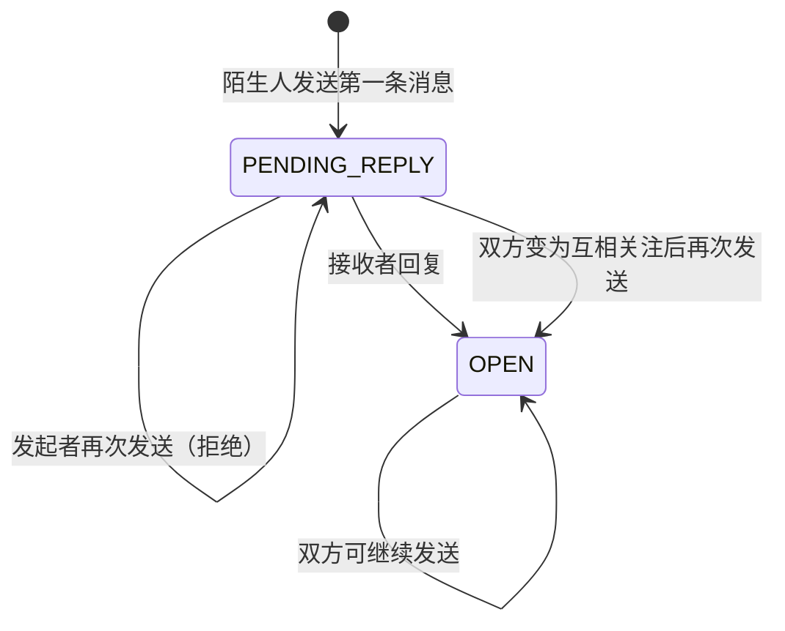

# “我的消息”功能设计文档

> 文档状态：V1.3，已同步第一版后端实现  
> 当前阶段：后端框架、核心业务和接口契约已落地；前端尚未开发

## 1. 设计结论

“我的消息”使用一个页面承载四个可切换模块：

1. 评论和@
2. 赞和转发
3. 系统消息
4. 私信

页面入口位于右上角头像下拉菜单中，放在“会员中心”下面。前三个模块属于“通知”，私信属于“会话”，它们只在页面和未读摘要层统一，后端数据不混存在一张表中。

除私信聊天需要同时展示收发双方消息外，评论、@、赞和转发模块始终采用“当前登录用户收到的消息”视角：

- 评论和@：别人评论当前用户的 Post、回复当前用户的评论，或者 @ 当前用户。
- 赞和转发：别人点赞当前用户的 Post 或评论，或者收藏、转发当前用户发布的 Post。
- 它们不是当前用户发出的评论、@、点赞、收藏或转发记录。

本设计采用以下原则：

- 复用现有 `user_notification`、Hit、用户和关注能力，不另建一套通知系统。
- 私信使用“会话 + 消息”模型，准确表达“首条陌生人消息等待回复”的状态。
- 第一阶段同步写入通知，不引入消息队列、事件总线或微服务。
- 消息列表只保存展示所需快照和跳转标识，不保存前端 URL。
- 所有写操作以 JWT 中的当前用户为准，客户端不能指定发送者。

## 2. 范围

### 2.1 本期包含

- 头像下拉菜单中的“我的消息”入口和未读提示。
- 四个模块的切换、分页、空状态、加载状态和未读角标。
- 当前用户收到的评论、回复和 @ 通知。
- 当前用户收到的点赞、收藏和转发通知。
- 平台系统消息和新增关注通知。
- 一对一纯文本私信。
- 陌生人首次私信限制，以及被接收者回复后解锁会话。
- 通知已读、会话已读和未读汇总。
- 完整的 `PublicUserProfile`：个人信息卡、关注/私信入口和四个内容分类列表。

### 2.2 本期不包含

- 群聊、图片、文件、语音、撤回、消息编辑。
- 拉黑、举报、免打扰和消息搜索。
- 管理后台的系统公告发布页面。
- 通过消息队列异步投递通知。
- 多端已读回执的实时推送。

这些能力后续可以基于本设计扩展，但不提前预留复杂抽象。

## 3. 页面与交互

### 3.1 页面路由与状态

建议页面路由为：

```text
/messages?tab=private
/messages?tab=comments
/messages?tab=interactions
/messages?tab=system
/messages?tab=private&chatboxId={id}
/messages?tab=private&userId={targetUserId}
```

路由参数保存当前模块和当前会话，使刷新、浏览器前进/后退和从个人主页进入私信时都能恢复状态。

默认打开“私信”。切换到私信模块只查询会话，不修改任何私信状态。
切换到“评论和@”“赞和转发”或“系统消息”时，将该模块当前未读通知全部设为已读，
角标立即归零，并且默认只展示最近一次批量已读的通知。“查看历史信息”用于分页查询更早的已读通知。

### 3.2 顶部导航

| 模块 | 包含内容 | 点击列表项后的行为 |
| --- | --- | --- |
| 评论和@ | 当前用户收到的评论、回复，以及别人对当前用户的 @ | 打开对应 Post；有评论 ID 时定位并高亮评论 |
| 赞和转发 | 当前用户的 Post 或评论收到的点赞，以及当前用户的 Post 收到的收藏、转发 | 点击头像或姓名打开行为发起者主页；点击目标内容打开对应 Post |
| 系统消息 | 平台消息、新增关注 | 不跳转；短内容保持原状，长内容展开/收起 |
| 私信 | 一对一会话摘要 | 导航栏保留，下方内容区从会话列表切换为聊天窗口 |

未读数显示在各模块名称旁，超过 99 显示为 `99+`。头像菜单只需要显示未读总数或红点，不在菜单内拆分四类。

### 3.3 通知列表项

通知列表项统一包含：

- 发起者头像和显示名；纯系统消息使用系统头像或图标。
- 行为描述，例如“评论了你的 Post”“@了你”“赞了你的 Post”。
- 内容摘要。
- 相对时间。
- 未读状态。

通知内容保存事件发生时的摘要快照，但列表展示时仍要校验源内容的当前状态：

- 评论、回复或 @ 对应的评论被删除时，通知行继续保留，但不再展示原评论摘要，统一显示“原评论已删除”。
- 回复通知关联的 `parentComment` 被删除时，同样隐藏原评论摘要并显示“原评论已删除”。
- 被赞的评论被删除时，赞通知行继续保留，目标摘要显示“原评论已删除”；点击该区域仍打开原评论所属的 Post，只是不再定位已删除的评论。
- Post 被删除或不可见时，通知行可以保留，但目标区域显示“原内容已删除或不可见”，并且不再执行跳转。

### 3.4 系统消息展开

- 默认最多展示两行正文。
- 第一次点击长消息：展开正文；通知在进入系统消息 Tab 时已经批量设为已读。
- 再次点击：收起。
- 新增关注属于系统消息，遵守“不跳转”规则。
- 展开状态只属于前端页面状态，不写入数据库。

### 3.5 私信列表与聊天窗口

私信模块初始展示会话列表，每项包含：

- 对方头像和显示名。
- 最后一条消息摘要。
- 最后消息时间。
- 当前会话未读数。

点击会话后，在原内容区域显示聊天窗口，并提供返回会话列表的按钮。打开聊天窗口只查询消息，
不批量修改状态；用户点击某一条自己收到的私信时，只把该条私信从 `SENT` 改为 `READ`。

从用户公开主页点击“发私信”时：

- 已有会话：直接打开该会话。
- 没有会话：使用 `userId` 打开与该用户的空聊天窗口。
- 只有真正发送第一条消息时才创建会话，避免产生大量空会话。

### 3.6 PublicUserProfile

公开主页分为上下两个区域。

页面上方是个人信息卡，包含：

- `MembershipInfoVO`
- `followerCount`
- `followingCount`
- `postCount`
- `answeredQuestionCount`
- `learnedBankCount`
- `studyHours`
- `receivedTotalActionCount`
- 关注和发私信操作所需的当前访问者关系状态

`receivedTotalActionCount` 表示该用户收到的点赞、收藏和转发数量总和，计算范围为：

```text
Post 点赞数
+ Comment 点赞数
+ Post 收藏数
+ Post 转发数
```

`postCount` 统计原创 Post 数与有效转发数之和，与下方 `posts` 分类的内容口径一致。

页面下方是主要内容区，包含四个可切换分类：

| 分类 | 内容 |
| --- | --- |
| `posts` | 用户发布的 Post，以及用户转发的 Post |
| `commented` | 用户发出过的评论 |
| `liked` | 用户点赞过的 Post 和 Comment |
| `favorite` | 用户收藏过的 Post |

进入公开主页时默认打开 `posts`。四类列表均不查询总记录数，即 MyBatis-Plus 使用 `searchCount=false`，只返回当前页记录。

## 4. 核心业务规则

### 4.1 评论和 @

“评论和@”包含两个通知类型：

- `COMMENT`：别人评论当前用户的 Post，或回复当前用户的评论。
- `MENTION`：别人在 Post 或评论中 @ 当前用户。

列表只查询 `receiver_user_id` 为当前登录用户的通知，不提供“我发出的评论或 @”记录。

推荐使用用户选择器确定被 @ 用户，并由前端提交稳定的用户 ID；显示名只负责展示，不使用可能重复或变化的显示名识别用户。

通知接收者规则：

- 自己对自己的内容操作，不产生通知。
- 同一条内容中重复 @ 同一用户，只产生一条通知。
- 如果同一用户既是回复对象又被 @，只产生一条 `COMMENT` 通知，避免重复提醒。
- 通知创建与评论/Post 创建处于同一事务；业务写入失败时不留下孤立通知。

### 4.2 赞、收藏和转发

- 其他用户点赞当前用户发布的 Post 或评论时，为当前用户创建通知。
- 其他用户收藏当前用户发布的 Post 时，为当前用户创建通知。
- 其他用户转发当前用户发布的 Post 时，为当前用户创建通知。
- Comment 只能被点赞、评论/回复和 @，不能被收藏或转发；后端不提供 Comment 收藏、转发入口。
- 列表只查询 `receiver_user_id` 为当前登录用户的通知，不展示当前用户自己发出的点赞、收藏或转发。
- 重复的“生效”请求不重复创建通知。
- 取消点赞、收藏或转发时撤销原通知，列表不再展示该通知。
- 取消操作本身不创建“取消了赞”“取消了收藏”或“取消了转发”的新通知。
- 自己点赞自己的 Post 或评论、收藏或转发自己的 Post，都不产生通知。
- 点击发起者头像或姓名时，使用 `actionUserId` 打开发起者公开主页。
- 点击被赞评论时，打开该评论所属的 Post；评论仍存在时可同时定位该评论。
- 被赞评论已经删除时，仍使用通知关联的稳定 `postId` 打开原 Post，但不再尝试定位该评论。
- 点击被点赞、收藏或转发的 Post 摘要时，打开对应 Post。
- 点击任一有效区域都会将通知标记为已读。

页签展示名称仍为“赞和转发”，但该模块实际聚合 `LIKE`、`FAVORITE` 和 `REPOST` 三类通知。

### 4.3 系统消息

系统模块包含：

- `SYSTEM`：平台写给具体用户的系统消息。
- `FOLLOW`：新增关注。

本期系统消息按用户写入 `user_notification`。暂不设计全站广播表和后台发布系统；将来确有大规模广播需求时，再拆分“公告 + 用户已读记录”，避免现在过度设计。

### 4.4 陌生人私信限制

推荐将“陌生人”定义为：

> 双方尚未互相关注，并且双方之间不存在已经被回复、接受的会话。

私信会话有两个核心状态：



具体规则：

- 陌生人第一次发送成功后，会话进入 `PENDING_REPLY`。
- 在接收者回复前，原发起者不能发送第二条消息。
- 接收者发送回复时，会话在同一事务内变为 `OPEN`。
- `OPEN` 后双方都可继续发送，即使后来取消关注也不重新锁定。
- 已互相关注的用户首次发送时，会话直接为 `OPEN`。
- 同一对用户只存在一个会话，通过数据库唯一约束和事务锁避免并发创建两条“首条消息”。

限制属于会话状态，不属于单条消息。因此不继续沿用现有 `allow_reason` 判断每一条消息。

## 5. 领域与数据设计

### 5.1 普通通知

沿用 `user_notification`，职责是保存非私信通知：

| 字段概念 | 用途 |
| --- | --- |
| `receiver_user_id` | 通知接收者 |
| `sender_user_id` | 行为发起者；纯系统消息可为空 |
| `notification_type` | `COMMENT`、`MENTION`、`LIKE`、`FAVORITE`、`REPOST`、`SYSTEM`、`FOLLOW` |
| `send_to` / `item_id` | 通知关联的对象类型及对象 ID |
| `post_id` | 关联 Post；评论删除后仍用于进入原 Post，无 Post 的通知为空 |
| `title` / `content` | 列表展示快照 |
| `read_status` | 未读或已读 |
| `created_time` | 排序和显示时间 |

私信不再额外写一条 `user_notification`，私信未读数直接来自私信消息，避免两份状态不一致。

列表查询时批量补齐：

- 发起者头像和显示名。
- 评论所属的稳定 Post ID；即使评论已被逻辑删除，也必须能够解析并返回该 ID。
- 评论及其 `parentComment` 当前是否仍然存在。
- 前端执行点击行为需要的结构化 ID。

不在数据库中存储前端路由 URL。

### 5.2 私信会话

新增 `private_chatbox`：

| 字段概念 | 用途 |
| --- | --- |
| `user_a_id` / `user_b_id` | 按用户 ID 排序后的双方 ID |
| `initiator_user_id` | 陌生会话的首次发送者 |
| `chat_access` | `PENDING_REPLY` 或 `OPEN` |
| `last_message_id` | 会话列表摘要 |
| `last_message_time` | 会话排序 |

`(user_a_id, user_b_id)` 建唯一索引，保证同一对用户只有一个会话。

### 5.3 私信消息

调整 `private_message`：

| 字段概念 | 用途 |
| --- | --- |
| `chatbox_id` | 所属私信聊天盒 |
| `sender_user_id` / `receiver_user_id` | 消息双方 |
| `content` | 纯文本正文 |
| `message_status` | `SENT` 或 `READ` |
| `created_time` | 聊天顺序 |

`allow_reason` 和“非互关首条消息唯一键”由 `chat_access` 替代。消息历史使用 `chatbox_id + id` 游标分页，避免聊天期间插入新消息导致翻页重复或遗漏。

### 5.4 关注关系

沿用 `user_follow`。以实际数据库结构为准，关注关系字段固定为：

- `follower_user_id`：发起关注的用户。
- `followee_user_id`：被关注的用户。

不新增 `following_user_id`。`sql/hit_feature.sql` 已统一为 `followee_user_id`，与现有数据库、`UserFollow` 实体和 `UserFollowMapper` 保持一致。

## 6. 接口边界

以下接口职责和字段已经作为第一版后端契约实现。

### 6.1 消息中心

| 能力 | 建议接口 |
| --- | --- |
| 获取四个模块未读数 | `GET /api/app/messages/unread-summary` |
| 打开通知模块并返回最近已读批次 | `PUT /api/app/messages/notifications/open-tab?tab=comments|interactions|system` |
| 查看更早的通知 | `GET /api/app/messages/notifications/history?tab=comments|interactions|system` |
| 获取聊天盒列表 | `GET /api/app/messages/chatboxes` |
| 获取指定聊天盒消息 | `GET /api/app/messages/chatboxes/{id}/messages` |
| 按目标用户查询已有聊天盒 | `GET /api/app/messages/chatboxes/with/{userId}` |
| 发送消息并按需创建会话 | `POST /api/app/messages/private` |
| 将单条私信标记为已读 | `PUT /api/app/messages/private/{messageId}/read` |

通知列表返回结构化目标：

- `COMMENT` / `MENTION`：`postId`，可选 `commentId`。
- `LIKE`：`actionUserId`、`postId`，被赞目标是评论时同时返回 `commentId`。
- `FAVORITE`：`actionUserId`、`postId`。
- `REPOST`：`actionUserId`、`postId`。
- `SYSTEM` / `FOLLOW`：无跳转目标。

对于已删除的评论，`commentId` 只用于表达原目标，不再用于页面定位；`postId` 仍必须返回并用于跳转。实现时可以从包含逻辑删除记录的评论查询中取得 `postId`，或者在创建通知时固化该 ID，代码级设计阶段再根据迁移成本确定。

### 6.2 用户公开主页

| 能力 | 建议接口 |
| --- | --- |
| 获取公开主页上方信息卡 | `GET /api/app/users/{userId}/profile` |
| 获取下方分类列表 | `GET /api/app/users/{userId}/profile/activities?tab=posts|commented|liked|favorite&pageNum=1&pageSize=20` |
| 显式设置关注状态 | `PUT /api/app/users/{userId}/follow` |

上方接口返回 `PublicUserProfileVO`，其中包含现有 `MembershipInfoVO`、指定的公开统计、当前访问者是否已关注，以及是否可以直接继续发送私信。

下方四类列表均使用 `searchCount=false`：

- `posts`：原创 Post 和转发 Post 按各自行为时间倒序混排。
- `commented`：当前主页用户发出的评论，携带所属 Post 信息。
- `liked`：当前主页用户点赞过的 Post 和 Comment。
- `favorite`：当前主页用户收藏过的 Post。

除明确要求的 `MembershipInfoVO` 和上述统计外，错题、收藏题目、笔记等用户中心私有数据不能出现在公开主页接口中。

关注接口使用显式的 `active=true/false`，避免“重试一次却把状态切回去”的 toggle 问题。

## 7. 已读与未读规则

- 通知只有接收者可以读取和标记已读。
- 切换到评论、互动或系统通知模块时，将该模块当前所有未读通知批量设为已读并清除角标。
- 通知模块默认只显示最近一次批量已读的通知；点击“查看历史信息”才查询更早的已读通知。
- 点击通知列表项或展开系统消息不再重复修改通知状态。
- 切换到私信模块和打开聊天窗口都只查询，不修改私信状态。
- 点击某一条自己收到的私信时，只把这一条私信标记为已读。
- 私信角标按“未读消息条数”统计；其他三个角标按“未读通知条数”统计。
- 头像菜单未读总数为四个角标之和，展示时可封顶为 `99+`。

## 8. 一致性、安全与异常

- 创建评论、@、点赞、收藏、转发、关注通知时，与原业务操作使用同一数据库事务。
- 发送私信时，校验接收者存在且不是自己，并锁定对应会话后判断发送权限。
- 所有查询都限定当前用户是通知接收者或会话参与者，防止越权读取。
- 私信正文第一版限制为纯文本和合理长度，前端展示时统一转义，防止 XSS。
- 已读、关注和互动接口保持幂等。
- 评论、`parentComment` 或被赞评论被删除后，通知仍可保留，但原摘要必须替换为“原评论已删除”。
- 评论被删除不影响跳转到其所属 Post；只有评论定位失效。Post 本身被删除或不可见时才禁止跳转。
- Post 被删除或隐藏后，通知可以保留，但不允许访问不可见资源。
- 第一阶段使用 REST 作为唯一数据源；聊天窗口可短轮询获取新消息，不立即引入 WebSocket。

## 9. 与当前仓库的关系

### 9.1 已复用

- `UserNotification`、`PrivateMessage`、`UserFollow` 基础实体。
- `HitServiceImpl` 中已有的评论、点赞、收藏和转发事务入口。
- `UserNotificationMapper`、`PrivateMessageMapper` 与逻辑删除能力。
- JWT 登录上下文、MyBatis-Plus 分页和逻辑删除机制。

### 9.2 第一版已落实

- 已建立消息 Controller、Service、通知写入服务和 Chatbox 私信状态机。
- 已恢复显式关注接口，并把新增关注纳入系统消息。
- 已增加 `MENTION`、Comment 点赞及其通知。
- 已建立 `PublicUserProfile` 信息卡、四个活动分类与 @ 用户搜索。
- 已统一 `followee_user_id`、`private_chatbox`、`chat_access` 和 `action*` 对外命名。
- 已提供新库基线 SQL 和旧库迁移 SQL。

## 10. 验收标准

### 10.1 评论和@

- 当前用户收到评论、回复或 @ 后，对应角标增加。
- 当前用户自己发出的评论、回复和 @ 不出现在该列表。
- 点击通知可以打开正确 Post，并在可能时定位评论。
- 对应评论或 `parentComment` 被删除后，通知行显示“原评论已删除”，不泄露原评论正文。
- 重复 @、自己 @ 自己和回复/@ 同一接收者不会产生重复通知。

### 10.2 赞、收藏和转发

- 其他用户点赞当前用户的 Post 或评论，以及收藏、转发当前用户的 Post 后通知一次；重复请求不重复通知。
- Comment 的收藏或转发请求不存在或被拒绝。
- 当前用户发出的点赞、收藏和转发不出现在该列表。
- 取消操作后原通知被撤销，不产生新的取消操作通知。
- 点击发起者头像或姓名进入正确的公开主页。
- 点击被赞评论或被点赞/收藏/转发的 Post 进入对应 Post。
- 被赞评论删除后，目标摘要显示“原评论已删除”，但点击后仍进入该评论原来所属的 Post，且不尝试定位评论。

### 10.3 系统消息

- 平台消息和新增关注出现在同一模块。
- 点击不发生路由跳转。
- 长内容可以展开和收起，并正确更新已读状态。

### 10.4 私信

- 会话列表按最后消息时间倒序。
- 陌生人只能发送第一条，第二条被稳定拒绝。
- 接收者回复后，双方均可继续发送。
- 打开会话后未读数正确归零。
- 用户不能读取、标记或发送到不属于自己的会话。

### 10.5 公开主页

- 从点赞/收藏/转发通知可以进入发起者主页。
- 当前用户可以显式关注/取消关注。
- “发私信”打开已有聊天或空聊天窗口。
- 页面上方返回 `MembershipInfoVO` 和七项指定统计。
- `receivedTotalActionCount` 正确汇总 Post/Comment 点赞、Post 收藏和 Post 转发。
- 页面下方提供 `posts`、`commented`、`liked`、`favorite`，默认打开 `posts`。
- `posts` 同时包含原创和转发；`liked` 同时包含点赞过的 Post 和 Comment。
- 四类列表均不执行总数查询。
- 除明确公开字段外，不泄露错题、收藏题目、笔记等用户中心私有数据。

## 11. 已确认的产品决定

1. `@` 同时支持 Post 正文和评论正文。
2. “陌生人”定义为未互相关注且会话未被回复；对方一旦回复，会话永久开放。
3. 第一版私信只支持纯文本，采用短轮询，不使用 WebSocket。
4. 私信角标统计未读消息条数。
5. 当前尚未设计或开发前端，也不存在可访问其他用户的公开主页；本期需要同时定义消息中心和公开主页的前端契约。
6. `PublicUserProfile` 上方使用 `MembershipInfoVO` 和指定统计，下方使用四个无总数查询的分类列表，默认分类为 `posts`。

下一阶段按数据库迁移、领域对象、Mapper、Service、Controller、DTO/VO、测试和前端对接顺序编写代码级实施方案。
