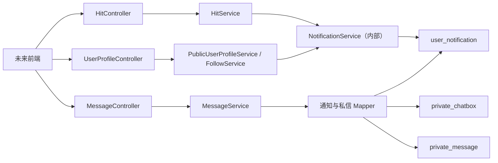

# “我的消息”代码级实施计划

> 文档状态：V1.0，第一版后端实现已完成  
> 前置文档：[“我的消息”功能设计文档](./my-messages-design.md)  
> 本文保留实现边界、数据迁移、接口契约和后续前端对接说明

## 1. 已冻结的实现边界

- 默认打开“私信”。
- `@` 同时支持 Post 和评论。
- “赞和转发”模块包含点赞、收藏、转发三类收到的通知。
- Post 支持点赞、收藏和转发；Comment 只支持点赞、评论/回复和 @，不支持收藏或转发。
- 陌生会话首条消息后等待对方回复；回复后永久开放。
- 第一版私信只支持纯文本，使用 REST 短轮询。
- 私信角标统计未读消息条数。
- 评论删除后隐藏原正文，但仍能跳转到所属 Post。
- 当前没有前端代码，本次后端接口同时作为未来前端的契约。
- `user_follow` 使用 `follower_user_id` 和 `followee_user_id`，不引入 `following_user_id`。
- `PublicUserProfile` 上方显示 `MembershipInfoVO` 和指定统计，下方显示四个无总数查询的活动分类，默认打开 `posts`。

## 2. 实现前代码基线

| 现状 | 影响 |
| --- | --- |
| 已有 `UserNotification`、`PrivateMessage`、`UserFollow`、相关枚举和 Mapper | 可以演进，不需要从零创建 |
| `MessageController`、`MessageService`、`MessageServiceImpl` 已从当前源码删除 | 按新设计重新建立，不能直接恢复旧版本 |
| 旧 `MessageServiceImplTest` 仍引用已删除的实现 | 需要改写测试 |
| `FollowController` 接口被注释，`FollowServiceImpl` 不存在 | 需要恢复关注完整链路 |
| `HitServiceImpl` 直接写 `UserNotificationMapper` | 应抽出内部通知服务，集中处理去重和撤销 |
| Post 已支持点赞、收藏、转发 | 保留现有 `hit_action`，降低迁移风险 |
| 评论尚不支持点赞，也没有 `like_count` | 新增独立评论点赞表和计数 |
| Hit 发布接口当前直接接收字符串 | 改为 DTO 后才能携带 `mentionedUserIds` |
| `UserNotificationType` 没有 `MENTION` | 增加枚举值并保持历史数值兼容 |
| 私信没有聊天盒表 | 新增 `private_chatbox` 并回填旧消息 |
| 公开主页服务已被删除，现有 User Center 是私有页面 | 新建 `PublicUserProfile` 接口；复用现有 `MembershipInfoVO`，不直接返回整个 User Center |
| `sql/hit_feature.sql` 使用了错误的 `following_user_id` | 修正为现有数据库的 `followee_user_id` |

以下记录保留用于说明第一版为什么采用当前改动范围；实现过程中没有覆盖工作区内无关的用户修改。

## 3. 目标代码分层



职责约束：

- Controller 只读取 JWT 用户、校验 DTO、调用 Service、包装 `Result`。
- `MessageService` 处理消息中心查询、已读和私信会话。
- `NotificationService` 是内部写入服务，供 Hit 和 Follow 调用，不直接暴露 HTTP。
- `HitService` 继续负责 Post、评论和互动的原业务事务。
- `PublicUserProfileService` 返回已确认公开的 `MembershipInfoVO`、统计、活动列表和访问者关系状态。
- Mapper 负责批量查询和必要的原子更新，不把业务状态机写进 Controller。

## 4. 数据库迁移

新增迁移文件：

```text
sql/my_messages_v1.sql
```

同时更新 `sql/hit_feature.sql`，保证全新环境使用最终结构。已有数据库执行迁移文件，不重复执行整份初始化脚本。

### 4.1 `user_notification`

保留现有表，新增：

```text
post_id BIGINT NULL
```

用途：

- Post 通知直接保存 Post ID。
- 评论、回复、评论 @、评论点赞通知同时保存所属 Post ID。
- 评论被逻辑删除甚至以后被清理时，仍能跳转到原 Post。

通知目标仍使用：

- `send_to = HIT_POST`、`item_id = postId`
- `send_to = HIT_COMMENT`、`item_id = commentId`
- `send_to = USER`、`item_id = actionUserId`

`post_id` 与 `item_id` 不重复承担同一种职责：Comment 通知的 `item_id` 用于定位具体 Comment，`post_id` 用于进入所属 Post；Comment 删除后只失去前者，后者仍然有效。Post 通知中两者可以是同一个 Post ID。

迁移时回填历史数据：

1. `HIT_POST` 目标的 `post_id = item_id`。
2. `HIT_COMMENT` 目标通过包含逻辑删除行的 `hit_comment` 查询回填 `post_id`。
3. 无法回填的历史脏数据保持 `NULL`，接口返回 `postAvailable=false`。
4. 旧的私信通知 `notification_type = 4` 逻辑删除，避免与私信表重复计算未读数。

索引建议：

```text
(receiver_user_id, is_deleted, notification_type, created_time DESC, id DESC)
(receiver_user_id, is_deleted, read_status, notification_type)
(send_to, item_id, is_deleted)
```

### 4.2 评论点赞

给 `hit_comment` 增加：

```text
like_count INT UNSIGNED NOT NULL DEFAULT 0
```

新增 `hit_comment_like`：

| 字段 | 说明 |
| --- | --- |
| `id` | 主键 |
| `comment_id` | 被赞评论 |
| `action_user_id` | 点赞者 |
| `created_time` / `updated_time` / `is_deleted` | 与 `BaseEntity` 一致 |

约束与索引：

```text
UNIQUE (comment_id, action_user_id)
INDEX (action_user_id, is_deleted, comment_id)
```

选择独立表而不改造 `hit_action` 的原因：

- 现有 Post 点赞、收藏、转发已能正常工作。
- 评论本期只有点赞，不需要通用三类互动。
- Comment 收藏和转发属于明确禁止的能力，不创建对应字段、枚举或接口。
- 避免迁移已有 `hit_action` 唯一键和历史数据。

### 4.3 `private_chatbox`

新增表：

| 字段 | 说明 |
| --- | --- |
| `id` | 会话 ID |
| `user_a_id` | 较小的用户 ID |
| `user_b_id` | 较大的用户 ID |
| `initiator_user_id` | 首次发消息的用户 |
| `chat_access` | `1=PENDING_REPLY`、`2=OPEN` |
| `last_message_id` | 最后一条消息 |
| `last_message_time` | 会话排序时间 |
| `created_time` / `updated_time` / `is_deleted` | 通用字段 |

约束：

```text
UNIQUE (user_a_id, user_b_id)
INDEX (user_a_id, is_deleted, last_message_time DESC)
INDEX (user_b_id, is_deleted, last_message_time DESC)
```

Service 始终用 `min(userId1, userId2)` 和 `max(...)` 生成用户对。

### 4.4 `private_message`

调整为：

| 字段 | 说明 |
| --- | --- |
| `chatbox_id` | 所属私信聊天盒，最终为非空 |
| `sender_user_id` / `receiver_user_id` | 收发双方 |
| `content` | 纯文本，最多 1000 个 Unicode 字符 |
| `message_status` | `1=SENT`、`2=READ`；旧 `BLOCKED` 仅兼容历史数据 |

新增索引：

```text
(chatbox_id, is_deleted, id DESC)
(receiver_user_id, message_status, is_deleted, id)
```

删除旧限制：

- `allow_reason`
- `first_non_mutual_key`
- `uk_private_first_non_mutual`

旧数据迁移顺序：

1. 为每一对历史收发用户创建一条会话。
2. 会话发起者取最早一条消息的发送者。
3. 双向都有消息或双方当前互相关注时标记为 `OPEN`，否则为 `PENDING_REPLY`。
4. 回填每条消息的 `chatbox_id`。
5. 回填会话最后消息和时间。
6. 将 `chatbox_id` 改为非空。
7. 最后删除旧限制字段和索引。

迁移必须在数据库备份或副本上先验证，不能直接假设现有私信表为空。

### 4.5 `user_follow`

现有数据库不需要新增列。只修正初始化 SQL：

```text
following_user_id → followee_user_id
```

相关唯一键和索引也统一使用 `followee_user_id`。

## 5. Model 模块调整

### 5.1 新增文件

```text
model/src/main/java/com/homework/model/entity/PrivateChatbox.java
model/src/main/java/com/homework/model/entity/HitCommentLike.java
model/src/main/java/com/homework/model/enums/PrivateChatAccess.java
```

### 5.2 修改文件

| 文件 | 修改 |
| --- | --- |
| `UserNotification.java` | 增加 `postId` |
| `PrivateMessage.java` | 增加 `chatboxId`，移除 `allowReason` |
| `HitComment.java` | 增加 `likeCount` |
| `UserNotificationType.java` | `REPLY(1)` 改名为 `COMMENT(1)`；保留数值；新增 `MENTION(8)` |
| `PrivateMessageStatus.java` | 新写入只使用 `SENT`、`READ`；保留 `BLOCKED(3)` 兼容旧数据 |
| `UserFollow.java` | 保持 `followeeUserId`，不增加其他同义字段 |

`PRIVATE_MESSAGE(4)` 可以保留为历史通知枚举值，但新代码不再创建或查询该类通知。`PrivateMessageAllowReason` 在迁移和新实现完成后删除。

## 6. DTO、VO 与接口契约

### 6.1 Hit DTO

修改：

```text
HitPostCreateDTO
  - content: String
  - tags: List<String>（保留现有字段和标签规则）
  - mentionedUserIds: List<Long>

HitCommentCreateDTO
  - parentCommentId: Long（可为空；为空表示直接评论 Post）
  - comment: String
  - mentionedUserIds: List<Long>
```

这里的“可为空”只是字段语义。实际 Java 声明为 `private Long parentCommentId;`；Java 不存在 `Long?` 语法。使用包装类型 `Long` 是因为它可以为 `null`，而基本类型 `long` 不能表示“没有 parentComment”。

约束：

- `mentionedUserIds` 可不传，统一按空集合处理。
- 去重后最多 10 人。
- 只接受存在且状态正常的用户。
- 当前用户从接收人中排除。
- 前端通过用户搜索选择用户并提交 ID；后端不依赖可能重复的 `displayName` 解析正文。

新增：

```text
HitCommentLikeDTO
  - actionStatus: ACTIVATE | DEACTIVATE
```

### 6.2 消息中心 VO

修改 `MessageUnreadSummaryVO`：

```text
commentsAndMentions
interactions
system
privateMessages
total
```

其中 `interactions` 聚合 `LIKE + FAVORITE + REPOST`。

修改 `NotificationVO`：

```text
id
notificationType
actionUserId
actionDisplayName
actionAvatar
title
content
postId
commentId
commentDeleted
postAvailable
readStatus
createdTime
```

装配规则：

- 评论或 `parentComment` 被删除：`content = "原评论已删除"`、`commentDeleted = true`。
- 被赞评论删除：同样返回占位文案，但保留 `postId`。
- Post 不可见：`postAvailable = false`。
- 系统消息的 action 用户信息和目标 ID 可为空。

新增：

```text
PrivateChatboxVO
PublicUserProfileVO
PublicUserProfileActivityVO
FollowStateVO
MentionUserVO
HitActionResultVO
```

`PrivateChatboxVO` 至少包含：

```text
chatboxId
otherUserId
otherDisplayName
otherAvatar
chatAccess
canCurrentUserSend
lastMessage
lastMessageTime
unreadCount
```

### 6.3 消息中心 HTTP 接口

全部路径位于 `/api/app/messages`，发送者/接收者权限从 JWT 和会话关系判断。

| 方法 | 路径 | 返回 |
| --- | --- | --- |
| `GET` | `/unread-summary` | 四模块未读数 |
| `PUT` | `/notifications/open-tab?tab=comments&pageNum=1&pageSize=20` | 评论和@全部已读并返回最近批次 |
| `PUT` | `/notifications/open-tab?tab=interactions&pageNum=1&pageSize=20` | 点赞、收藏、转发全部已读并返回最近批次 |
| `PUT` | `/notifications/open-tab?tab=system&pageNum=1&pageSize=20` | 系统和新增关注全部已读并返回最近批次 |
| `GET` | `/notifications/history?tab=...` | 分页查询最近批次之前的已读通知 |
| `GET` | `/chatboxes?pageNum=1&pageSize=20` | 私信聊天盒列表 |
| `GET` | `/chatboxes/with/{userId}` | 查询与目标用户的已有聊天盒，可为空 |
| `GET` | `/chatboxes/{id}/messages?beforeId=&afterId=&limit=50` | 历史翻页或短轮询增量 |
| `POST` | `/private` | 发送消息，按需创建会话 |
| `PUT` | `/private/{messageId}/read` | 将当前用户收到的一条私信设为已读 |

分页规则：

- 通知和会话列表沿用项目现有 `PageResult` 和 `pageNum/pageSize`。
- 查询排序同时使用 `created_time DESC, id DESC`，保证同一时间下顺序稳定。
- 聊天历史使用 `beforeId` 倒序取数，Service 返回给前端前恢复正序。
- 短轮询使用 `afterId` 正序取新消息。
- `beforeId` 和 `afterId` 不能同时传。
- 默认 `limit=20/50`，最大 100。

发送私信请求：

```json
{
  "receiverUserId": 42,
  "content": "你好，可以交流一下吗？"
}
```

返回完整的 `PrivateMessageVO`，便于前端立即追加到聊天窗口，不只返回 ID。

### 6.4 Hit 接口

| 方法 | 路径 | 调整 |
| --- | --- | --- |
| `POST` | `/api/app/hits` | 请求体改为 `HitPostCreateDTO` |
| `POST` | `/api/app/hits/{postId}/comments` | 接收评论中的 `mentionedUserIds` |
| `PUT` | `/api/app/hits/{postId}/comments/{commentId}/like` | 评论点赞/取消点赞 |

顺便修正当前 `HitController` 中路径已经包含 `{postId}` 却仍使用 `@RequestParam` 的问题，统一改为 `@PathVariable`。

### 6.5 用户与公开主页接口

| 方法 | 路径 | 用途 |
| --- | --- | --- |
| `GET` | `/api/app/users/search?keyword=&limit=10` | @ 用户选择器 |
| `GET` | `/api/app/users/{userId}/profile` | 公开主页上方个人信息卡 |
| `GET` | `/api/app/users/{userId}/profile/activities?tab=posts&pageNum=1&pageSize=20` | 下方四类活动列表 |
| `PUT` | `/api/app/users/{userId}/follow` | 显式关注或取消关注 |

关注请求：

```json
{
  "active": true
}
```

`PublicUserProfileVO` 返回：

```text
userId
membershipInfoVO
followerCount
followingCount
postCount
answeredQuestionCount
learnedBankCount
studyHours
receivedTotalActionCount
followedByCurrentUser
mutualFollow
chatboxId（可为空）
```

`postCount = 原创 Post 数 + 有效 REPOST 行为数`，与 `posts` 分类保持一致。

其中 `membershipInfoVO` 直接复用现有 `MembershipInfoVO`。`receivedTotalActionCount` 使用数据库聚合计算：

```text
当前用户有效 Post 的 like_count + favorite_count + repost_count
+ 当前用户有效 Comment 的 like_count
```

活动列表 tab：

| tab | 查询内容 | `PublicUserProfileActivityVO.activityType` |
| --- | --- | --- |
| `posts` | 原创 Post 与转发 Post | `POST` / `REPOST` |
| `commented` | 用户发出的评论 | `COMMENT` |
| `liked` | 用户点赞的 Post 与 Comment | `LIKED_POST` / `LIKED_COMMENT` |
| `favorite` | 用户收藏的 Post | `FAVORITE` |

每项至少包含 `activityType`、`activityTime`、所属 `post` 摘要和可选的 `comment` 摘要。Comment 类型点击后进入所属 Post。

四个查询直接使用 `LIMIT/OFFSET` 且不执行 COUNT SQL，效果等同 `searchCount=false`；并按 `activity_time DESC, activity_id DESC` 稳定排序。接口只返回当前页记录，不返回或伪造总数。进入页面时前端默认请求 `tab=posts`。

除了明确公开的 `MembershipInfoVO` 和上述统计，不返回错题、收藏题目、笔记等用户中心私有数据。

前端打开私信时：

- `chatboxId` 非空：进入 `/messages?tab=private&chatboxId={id}`。
- `chatboxId` 为空：进入 `/messages?tab=private&userId={targetUserId}`，第一条消息发送成功后再替换为正式聊天盒路由。

## 7. Service 与 Mapper 设计

### 7.1 `NotificationService`

新增内部接口：

```text
createCommentNotification(...)
createMentionNotifications(...)
createPostActionNotification(...)
createCommentLikeNotification(...)
createFollowNotification(...)
removePostActionNotification(...)
removeCommentLikeNotification(...)
removeFollowNotification(...)
```

实现要求：

- 接收者等于发起者时直接跳过。
- 接收者集合先去重。
- 回复对象与 @ 对象相同时，`COMMENT` 优先，只写一条。
- 与 Hit/Follow 的原操作共享事务传播级别 `REQUIRED`。
- 取消点赞、收藏、转发或评论点赞时逻辑删除原通知，不创建取消通知。
- 每条评论相关通知写入 `post_id`。

### 7.2 通知查询

`MessageService.loadNotificationTab`：

1. 强制 `receiver_user_id = 当前用户`。
2. 根据 tab 映射类型：
   - comments：`COMMENT + MENTION`
   - interactions：`LIKE + FAVORITE + REPOST`
   - system：`SYSTEM + FOLLOW`
3. 正常打开 Tab 时，把该类型下当前所有 `UNREAD` 通知一次性更新为 `READ`。
4. 使用最近一次批量更新的 `updated_time` 查询默认展示批次。
5. “查看历史信息”只查询该时间之前的已读通知，并且不修改状态。
6. 批量查询 action 用户，避免 N+1。
7. 批量查询目标评论和 parentComment，查询必须包含逻辑删除行。
8. 批量查询 Post 可见状态。
9. 组装删除占位、跳转 ID 和 `postAvailable`。

`UserNotificationMapper` 增加：

- 游标分页查询。
- 按接收者和类型批量已读。
- 按互动唯一条件撤销通知。
- 未读分类聚合查询，优先用一条条件聚合 SQL 返回前三类数量。

### 7.3 @ 通知

`HitService.publish` 和 `comment` 改为：

1. 校验并保存 Post/评论。
2. 批量加载 `mentionedUserIds` 对应的有效用户。
3. 计算最终接收者集合。
4. 调用 `NotificationService`。
5. 整体处于一个 `@Transactional` 事务。

用户搜索：

- 只查询 `ACTIVE + USER`。
- 支持 `account_no` 精确/前缀和 `display_name` 模糊搜索。
- 排除当前用户。
- 限制返回数量，禁止无关键字全表扫描。

### 7.4 评论点赞

新增 `HitCommentLikeMapper`：

- `selectIncludingDeletedForUpdate(commentId, actionUserId)`
- `restoreById(id)`
- `deactivateById(id)`

`HitCommentMapper` 增加：

- 锁定仍有效的评论。
- 原子修改 `like_count`，下限为 0。
- 按 ID 批量查询包含逻辑删除的评论。

事务顺序：

1. 校验 Post 可见。
2. 锁定评论。
3. 幂等插入、恢复或逻辑删除点赞记录。
4. 原子更新评论计数。
5. 创建或撤销通知。

`HitCommentVO` 增加：

```text
likeCount
liked
```

列表评论时批量查询当前用户已点赞的评论，避免逐条查询。

### 7.5 私信状态机

新增 `PrivateChatboxMapper`：

- 按规范化用户对查询。
- `SELECT ... FOR UPDATE` 锁定会话。
- 原子更新状态和最后消息。
- 查询当前用户的会话列表和每个会话未读数。

发送流程：

1. 校验接收者存在、有效且不是自己。
2. 规范化 `(user_a_id, user_b_id)`。
3. 查询并锁定已有会话。
4. 不存在时：
   - 双方互关：创建 `OPEN`。
   - 未互关：创建 `PENDING_REPLY`，当前发送者为 initiator。
5. 并发创建命中唯一键时，重新查询并锁定，而不是返回数据库异常。
6. 已有 `PENDING_REPLY` 时：
   - initiator 再发且仍未互关：拒绝。
   - 对方回复：切换为 `OPEN`。
   - 双方已变为互关：切换为 `OPEN`。
7. 插入消息。
8. 更新会话最后消息。
9. 整个流程在一个事务中提交。

`OPEN` 不会因以后取消关注重新变为 `PENDING_REPLY`。

已读：

```text
UPDATE private_message
SET message_status = READ
WHERE chatbox_id = ?
  AND receiver_user_id = 当前用户
  AND message_status = SENT
  AND is_deleted = 0
```

### 7.6 关注

恢复 `FollowServiceImpl`，所有列使用 `followee_user_id`。

实现：

- 禁止关注自己。
- 校验目标用户有效。
- 对 `(follower_user_id, followee_user_id)` 加锁。
- `active=true` 时插入或恢复，只有状态真实变化才创建 `FOLLOW` 通知。
- `active=false` 时逻辑删除关系，并撤销对应新增关注通知。
- 返回实际状态、粉丝数和是否互关。

### 7.7 PublicUserProfile

新增 `PublicUserProfileService`：

- 查询目标用户必须为正常用户。
- 复用现有 `MembershipInfoVO` 组装个人信息。
- 使用聚合 SQL 一次返回六项普通统计和 `receivedTotalActionCount`，不能把用户全部 Post、Comment 加载到 Java 后再求和。
- 单独计算当前访问者是否关注目标用户、是否互关。
- 查询已有私信会话 ID，供“发私信”按钮决定路由。
- 用户自己的主页返回 `self=true`、`followedByCurrentUser=null`、`canFollow=false`、`canSendPrivateMessage=false` 和 `chatboxId=null`。

新增 `PublicUserProfileMapper` 和 `PublicUserProfileMapper.xml`：

- `selectProfileCounts(userId)`：返回关注、Post、答题、题库、学习时长和收到互动总数。
- `listPosts(page, userId)`：使用 `UNION ALL` 合并原创 Post 和 `REPOST` 行为，以行为时间排序。
- `listCommented(page, userId)`：查询用户有效评论并关联仍可访问的 Post。
- `listLiked(page, userId)`：使用 `UNION ALL` 合并 `hit_action` 中的 Post 点赞与 `hit_comment_like` 中的 Comment 点赞。
- `listFavorite(page, userId)`：只查询 `hit_action` 中的 Post 收藏。

Service 只按白名单接受 `posts`、`commented`、`liked`、`favorite`。Comment 不存在收藏和转发查询分支。

## 8. 错误返回

第一版沿用项目现有错误边界：Hit 业务继续使用已有 `HomeworkException + ResultCodeEnum`；消息、关注和公开主页的可修正请求错误使用 `IllegalArgumentException`，由全局处理器返回 `PARAM_ERROR` 和具体提示。这样不在当前已有重复数值的错误码表上继续扩张。

## 9. 文件级改动清单

### 9.1 新增

```text
sql/my_messages_v1.sql

model/.../entity/PrivateChatbox.java
model/.../entity/HitCommentLike.java
model/.../enums/PrivateChatAccess.java

web/web-app/.../controller/MessageController.java
web/web-app/.../controller/UserProfileController.java
web/web-app/.../dto/FollowActionDTO.java
web/web-app/.../dto/HitCommentLikeDTO.java
web/web-app/.../vo/PrivateChatboxVO.java
web/web-app/.../vo/PublicUserProfileVO.java
web/web-app/.../vo/PublicUserProfileActivityVO.java
web/web-app/.../vo/PublicUserProfileCountsVO.java
web/web-app/.../vo/FollowStateVO.java
web/web-app/.../vo/MentionUserVO.java
web/web-app/.../vo/HitActionResultVO.java
web/web-app/.../vo/HitCommentLikeResultVO.java
web/web-app/.../mapper/PrivateChatboxMapper.java
web/web-app/.../mapper/HitCommentLikeMapper.java
web/web-app/.../mapper/PublicUserProfileMapper.java
web/web-app/src/main/resources/mapper/PublicUserProfileMapper.xml
web/web-app/.../service/MessageService.java
web/web-app/.../service/NotificationService.java
web/web-app/.../service/PublicUserProfileService.java
web/web-app/.../service/impl/MessageServiceImpl.java
web/web-app/.../service/impl/NotificationServiceImpl.java
web/web-app/.../service/impl/FollowServiceImpl.java
web/web-app/.../service/impl/PublicUserProfileServiceImpl.java
```

### 9.2 修改

```text
sql/hit_feature.sql

model/.../entity/UserNotification.java
model/.../entity/PrivateMessage.java
model/.../entity/HitComment.java
model/.../enums/UserNotificationType.java
model/.../enums/PrivateMessageStatus.java

web/web-app/.../controller/HitController.java
web/web-app/.../controller/FollowController.java
web/web-app/.../dto/HitPostCreateDTO.java
web/web-app/.../dto/HitCommentCreateDTO.java
web/web-app/.../vo/NotificationVO.java
web/web-app/.../vo/PrivateMessageVO.java
web/web-app/.../vo/MessageUnreadSummaryVO.java
web/web-app/.../vo/HitCommentVO.java
web/web-app/.../mapper/UserNotificationMapper.java
web/web-app/.../mapper/PrivateMessageMapper.java
web/web-app/.../mapper/UserFollowMapper.java
web/web-app/.../mapper/HitCommentMapper.java
web/web-app/.../service/HitService.java
web/web-app/.../service/FollowService.java
web/web-app/.../service/impl/HitServiceImpl.java
docs/hit-api.md
```

### 9.3 删除

第一版已删除：

```text
model/.../enums/PrivateMessageAllowReason.java
```

## 10. 测试计划

### 10.1 通知

- 只返回当前用户作为 `receiver_user_id` 的通知。
- comments tab 同时包含 `COMMENT` 和 `MENTION`。
- interactions tab 同时包含 `LIKE`、`FAVORITE`、`REPOST`。
- 自己的互动不创建通知。
- 回复对象与 @ 对象相同时只创建一条。
- 删除评论或 parentComment 后返回“原评论已删除”。
- 删除评论后仍返回正确 `postId`。
- Post 不可见时 `postAvailable=false`。
- 取消点赞、收藏、转发、评论点赞时撤销原通知且不创建取消通知。
- 已读接口不能修改他人的通知。

### 10.2 私信

- 陌生人第一条发送成功。
- 同一 initiator 的第二条在未回复前被拒绝。
- 对方回复后会话变为 `OPEN`。
- `OPEN` 后即使取消关注仍可继续发送。
- 互相关注用户第一次发送直接 `OPEN`。
- 并发首条消息只创建一个会话。
- 非参与者不能查询、发送或标记已读。
- 私信拒绝空正文和超长正文；看起来像 Markdown、HTML 或 URL 的字符仍按普通纯文本保存，前端不得把它们解释为附件或未转义 HTML。
- 打开会话后只标记当前用户收到的消息。
- 私信未读角标按消息条数统计。

### 10.3 Hit 与关注

- Post 和评论中的 @ 都能创建通知。
- 无效 @ 用户触发稳定错误。
- 评论点赞重复激活和重复取消均幂等。
- 评论点赞计数不会小于 0。
- Comment 没有收藏或转发接口，构造此类请求时必须返回未匹配路由或稳定参数错误。
- 收藏通知继续归入 interactions。
- 关注重复请求不重复写关系或通知。
- 所有关注 SQL 使用 `followee_user_id`。

### 10.4 PublicUserProfile

- 上方个人信息卡返回现有 `MembershipInfoVO`。
- 正确返回 `followerCount`、`followingCount`、`postCount`、`answeredQuestionCount`、`learnedBankCount`、`studyHours`。
- `receivedTotalActionCount` 等于 Post 点赞/收藏/转发和 Comment 点赞的总和。
- 正确返回关注、互关和已有会话状态。
- 禁用或不存在用户不可访问。
- 查看自己的主页时不提供关注/私信操作。
- 默认分类为 `posts`。
- `posts` 同时包含原创 Post 和转发 Post，并按行为时间排序。
- `commented` 只包含该用户发出的评论。
- `liked` 同时包含该用户点赞的 Post 和 Comment。
- `favorite` 只包含该用户收藏的 Post。
- 四类查询均不能执行 COUNT SQL；当前实现直接使用无总数的 `LIMIT/OFFSET`。
- 除已确认字段外，不返回错题、收藏题目、笔记等私有数据。

### 10.5 构建基线

已执行干净构建和本功能定向测试：

- 主代码和测试代码 clean 编译成功。
- 消息、Hit 和公开主页 10 项定向测试全部通过。
- 完整 35 项测试仍有 3 项既有 `MembershipServiceTest` 失败：两项缺少用户 Mock 数据，一项会员到期时间预期相差 31 天；本功能测试均通过。

验证命令必须包含 `clean`：

```text
mvn -pl web/web-app -am clean test
```

本功能测试先单独通过，再运行完整测试；既有失败不得误归因给消息功能。

## 11. 前端对接规划

当前没有前端工程，因此本阶段不创建前端文件。后端完成后，未来前端按以下组件拆分：

```text
AvatarMenu
MessagesPage
MessageTabs
NotificationList
CommentNotificationRow
InteractionNotificationRow
SystemNotificationRow
PrivateChatboxList
ChatPanel
PublicUserProfilePage
PublicUserProfileTabs
PublicUserProfileActivityList
FollowButton
PrivateMessageButton
MentionUserPicker
```

关键行为：

- `/messages` 无 tab 时重定向到 `?tab=private`。
- 从公开主页发私信时，有聊天盒使用 `chatboxId`，无聊天盒使用目标 `userId` 打开空聊天窗口。
- `/users/:userId` 默认选中 `posts`；切换 `commented`、`liked`、`favorite` 时只替换下方列表。
- 公开主页四类列表使用无总数分页，前端不展示依赖 `total` 的分页控件。
- 打开聊天窗口时每 3 秒使用 `afterId` 拉取新消息。
- 未打开聊天窗口时不轮询所有会话消息，只每 30 秒刷新未读摘要。
- 页面重新获得焦点时立即刷新未读摘要和当前会话。
- 互动通知头像/姓名和目标内容是两个独立点击区域。
- 已删除评论显示“原评论已删除”；点击目标区域仍打开 `postId`，不携带评论锚点。
- 系统长消息展开状态只保存在组件状态中。
- 所有时间由后端返回绝对时间，前端负责显示“5 分钟前”等相对文案。

## 12. 分步实施顺序

遵循“先搭框架，再逐个填满”的顺序，每一步都保持可编译：

1. **基线与迁移准备**
   - clean 构建并记录既有失败。
   - 备份/核对实际表结构。
   - 完成迁移 SQL，但先在副本验证。

2. **数据与类型框架**
   - 新增会话、评论点赞实体和枚举。
   - 调整现有实体、DTO、VO。
   - 编译 model 和 web-app 主代码。

3. **通知读取骨架**
   - 建立 `MessageController`、`MessageService`、Mapper 查询。
   - 先完成分类列表、删除占位、已读和未读汇总。
   - 补齐通知查询测试。

4. **通知写入骨架**
   - 建立内部 `NotificationService`。
   - 将 Hit 现有直接写 Mapper 的逻辑迁入内部服务。
   - 保证原 Post 点赞、收藏、转发行为不回归。

5. **@ 与评论点赞**
   - Hit 发布/评论改为 DTO。
   - 实现用户搜索、@ 通知、评论点赞和计数。
   - 完成相关单元测试。

6. **私信会话**
   - 完成会话 Mapper、状态机、列表、历史、增量轮询和已读。
   - 替换旧私信测试。

7. **关注与公开主页**
   - 恢复关注实现。
   - 新增 `PublicUserProfile` 信息卡统计和四类无总数活动列表。
   - 接入系统关注通知。

8. **接口与回归**
   - Controller 测试、越权测试、并发边界测试。
   - 更新 `docs/hit-api.md`。
   - 运行完整 clean test。

9. **前端阶段**
   - 后端契约冻结后再创建前端工程或在指定前端仓库实现。

## 13. 完成定义

只有同时满足以下条件，后端功能才算完成：

- 迁移脚本在数据库副本成功执行并验证历史数据。
- 四模块列表和未读数符合接收者视角。
- 评论删除后的文案与 Post 跳转符合设计。
- 点赞、收藏、转发、评论点赞通知完整且可撤销。
- 私信状态机、已读和短轮询通过测试。
- `PublicUserProfile` 信息卡、四类活动列表和默认 `posts` 行为符合设计。
- 除明确要求的 `MembershipInfoVO` 和统计外，公开主页不泄露其他私有数据。
- `followee_user_id` 在 SQL、实体、Mapper 和 Service 中完全一致。
- 主代码 clean 编译成功，本功能相关测试全部通过。
- API 文档包含前端所需的字段、错误提示和交互规则。
