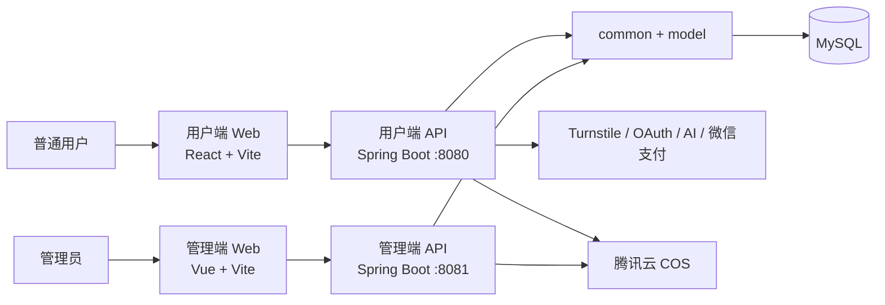

# HomeWork 系统设计概览

> 文档范围：当前 monorepo 中的用户端、管理端和后端实现  
> 更新日期：2026-07-26

## 1. 项目定位

HomeWork 是一个面向题库学习和备考的 Web 平台。系统的主业务是：

1. 用户注册、登录并选择面试题库或认证题库。
2. 用户进行练习或考试，保存答案、错题、收藏和笔记。
3. 运营人员在管理后台维护题库、题目和发布状态。

社区 Hit、消息私信、公开主页、学习日历和会员支付用于完善学习体验；后台的数据看板、
用户治理、会员运营和操作日志属于辅助运营能力。

## 2. 用户与主要功能

### 2.1 普通用户

- 邮箱注册和登录；代码层保留第三方 OAuth 接入能力。
- 浏览首页推荐、面试题库和认证题库。
- 面试题作答、AI 反馈和答案解析。
- 认证题练习、正式考试、自动判题和结果回顾。
- 管理错题、收藏、笔记和历史答题记录。
- 发布 Hit、评论、互动、关注用户和发送私信。
- 购买 Premium / Premium Plus，查询订单和会员状态。

### 2.2 管理员

- 通过邀请激活账号并独立登录管理后台。
- 创建、编辑、发布、下架和删除题库。
- 在题库工作台维护题目、图片、顺序和发布状态。
- 使用 Excel 批量预检并导入题目。
- 辅助管理用户、社区内容、会员套餐、管理员权限和审计日志。

## 3. 总体架构



用户端 API 与管理端 API 是两个独立应用，共用实体模型、公共返回结构、JWT 工具和
同一个业务数据库。两套 Token 相互隔离，管理端不能使用用户 Token，用户端也不能
使用 Admin Token。

## 4. 代码组织

| 目录 | 职责 |
| --- | --- |
| `frontend/web-app` | React 用户端页面、路由、API 客户端和前端测试 |
| `frontend/web-admin` | Vue 管理后台、权限路由和运营页面 |
| `backend/common` | 统一返回、异常处理、JWT、密码编码、COS 和通用工具 |
| `backend/model` | 数据实体和业务枚举 |
| `backend/web/web-app` | 用户端 Controller、Service、Mapper 和配置 |
| `backend/web/web-admin` | 管理端 Controller、Service、Mapper 和权限控制 |
| `sql` | 初始化和增量迁移脚本 |
| `docs` | 系统、接口和专题设计文档 |

前端由根目录 pnpm workspace 统一管理，后端由 `backend/pom.xml` 统一管理 Maven
模块。

## 5. 技术方案

| 层级 | 主要技术 |
| --- | --- |
| 用户端前端 | React、TypeScript、React Router、TanStack Query、Tailwind CSS |
| 管理端前端 | Vue、TypeScript、Vue Router、Pinia、Element Plus |
| 后端 | Java、Spring Boot、MyBatis-Plus、MySQL |
| 鉴权 | 用户 JWT、管理员独立 JWT、管理员权限码 |
| 文件 | 腾讯云 COS 私有存储和临时签名读取 URL |
| 支付 | 微信 Native 支付与服务端异步回调 |
| 质量 | Vitest、Testing Library、Playwright、JUnit、Maven |

## 6. 核心业务设计

### 6.1 题库与题目

题库按“分类组 → 模块 → 子模块 → 题库 → 题目”组织，分为面试题库和认证题库。
后台负责维护内容，用户端只读取已发布且有权限访问的数据。

- 面试题以简答为主，提交后返回 AI 反馈和参考答案。
- 认证题支持单选、多选等客观题，可选择练习模式或考试模式。
- 题目与题库通过关联关系绑定，题目顺序由后台显式维护。
- 题库和题目具有草稿、发布、下架等生命周期，状态变化由后端校验。

### 6.2 学习与考试

练习模式允许用户逐题提交并立即查看解析。考试模式由服务端创建考试场次，保存临时
答案、控制场次有效期并在交卷时统一判题。用户完成题库后，系统沉淀：

- 答题记录和完成状态；
- 错题、收藏和笔记；
- 面试题 AI 评价；
- 题库维度的复习数据。

AI 追问会按用户和题库复用会话，结合当前题目、答案解析和历史消息生成后续回复。

### 6.3 内容管理

管理后台以题库为入口：

1. 创建题库并选择分类。
2. 在题库工作台手动创建题目，或通过 Excel 上传预检。
3. 修正错误数据、调整题目顺序并发布题目。
4. 题库至少包含可发布题目后才能正式发布。

题目图片先上传到 COS，保存时再与题目绑定。管理操作使用权限码、题库数据范围、
乐观锁版本和操作原因进行保护。

### 6.4 社区与消息

Hit 是轻量学习动态，支持发布、评论、回复、点赞、收藏、转发和 @ 用户。互动会生成
评论、互动或系统通知。私信按 Chatbox 组织，并限制陌生用户连续发送消息；双方互相关注
或收到回复后，会话可正常持续。

公开主页展示用户的基础信息和社区活动。学习日历、关注关系和消息未读数属于辅助能力。

### 6.5 会员与支付

系统提供 Premium 和 Premium Plus 两级会员：

- Premium Plus 包含 Premium 权益。
- 高等级生效时，基础会员剩余时长按业务规则冻结。
- 支持全款购买和符合条件时的补差升级。
- 价格、资格和有效期全部由后端计算，前端只提交 `planId`。

创建订单时使用 `Idempotency-Key` 防止重复下单。支付成功只能由完成签名校验和解密的
微信回调确认，前端轮询不能直接发放会员权益。

## 7. 主要业务流程

### 7.1 用户学习

```text
登录 → 浏览题库 → 进入练习/考试 → 保存答案 → 完成题库
     → 查看解析 → 错题/收藏/笔记 → 后续复习
```

### 7.2 内容发布

```text
管理员登录 → 创建题库 → 创建或导入题目 → 校验与排序
           → 发布题目 → 发布题库 → 用户端可见
```

### 7.3 会员购买

```text
选择套餐 → 创建幂等订单 → 展示微信二维码 → 微信异步通知
         → 服务端验签并更新订单 → 发放权益 → 前端轮询到成功
```

## 8. 数据与一致性

- MySQL 保存用户、题库、题目、答题、社区、消息、会员和后台审计数据。
- MyBatis-Plus 负责基础数据访问，复杂查询使用 Mapper XML。
- 业务写操作放在 Service 层处理，Controller 只负责参数接收和响应包装。
- 可编辑的后台资源使用 `version` 做乐观锁，避免多人编辑互相覆盖。
- 订单、支付回调、导入任务和状态动作在服务端进行重复请求保护。
- 删除以业务状态或逻辑删除为主，需要保留的运营和支付历史不会直接丢弃。

## 9. 安全设计

- `/api/app/**` 使用用户 JWT；认证接口除外。
- `/api/admin/**` 使用独立 Admin JWT；登录和邀请接口除外。
- 管理后台同时检查管理员状态、权限码和题库数据范围。
- 永久封禁、会员回收、套餐和管理员权限等高风险操作需要一次性二次认证 Token。
- 密码、JWT 密钥、支付密钥和 COS 密钥只从本地或部署环境变量读取。
- 私有题目图片通过短时签名 URL 访问。
- 微信支付回调必须完成平台签名校验、解密和订单金额校验。
- 注册和登录可使用 Cloudflare Turnstile 防止机器人请求。

## 10. 部署与运行

| 服务 | 默认地址 | 说明 |
| --- | --- | --- |
| 用户端前端 | `http://127.0.0.1:5173` | `/api` 代理到用户端 API |
| 管理端前端 | `http://localhost:5174` | `/api/admin` 代理到管理端 API |
| 用户端 API | `http://127.0.0.1:8080` | 面向普通用户 |
| 管理端 API | `http://localhost:8081` | 面向运营管理员 |
| MySQL | `127.0.0.1:3306/home_work` | 可由环境变量覆盖 |

生产环境应分别构建两个静态前端和两个 Spring Boot JAR，并通过反向代理统一 HTTPS、
API 路径和跨域策略。

## 11. 测试重点

- 用户端：鉴权路由、题库加载、答题、消息、会员下单和响应状态。
- 管理端：权限路由、题库与题目状态动作、Excel 导入和批量操作。
- 后端：考试、题目访问、社区互动、消息权限、会员状态机和支付回调。

## 12. 相关文档

- [主要 API 接口](api-reference.md)
- [用户端前端详细设计](frontend-engineering-design.md)
- [后台管理系统详细设计](web-admin-system-design.md)
- [后台管理 API 详细文档](web-admin-api.md)
- [会员与支付](membership-api.md)
- [Hit、消息与公开主页](hit-api.md)

