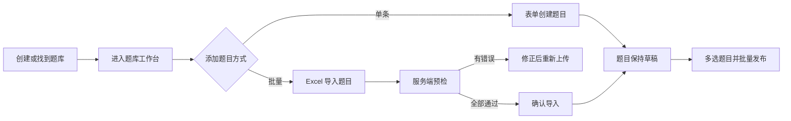

# Homework 后台管理系统前端设计文档

> 文档版本：V1.1  
> 设计日期：2026-07-26  
> 对应后端：`web-admin` V1、后台接口文档 46 个接口  
> 当前阶段：核心产品决策已确认，尚未创建前端工程

## 1. 设计结论

前端采用桌面端后台工作台形态，整体追求简洁、低学习成本和高操作效率。题库与题目是一级核心功能，用户、社区、会员、管理员和审计等低频模块只提供完成基础工作所需的页面。

核心设计结论：

1. 技术栈使用 `Vue 3 + TypeScript + Vite + Element Plus`。
2. 默认首页是数据概览，但侧边栏将“题库管理”置于最显眼的位置。
3. 题库详情采用“题库工作台”，集中完成题目浏览、创建、批量导入、排序和题库设置。
4. 题库只能由管理员手动创建并选择类型，不提供任何“上传题库”能力。
5. 管理员必须先找到并进入题库，才能单条创建题目或通过 Excel 批量导入题目。
6. 批量导入使用三步向导：上传与预检、确认导入、完成。
7. 导入后的题目默认草稿，题目列表提供多选操作栏，可批量发布选中题目。
8. 所有导入内容先经过服务端预检；存在任意错误时不允许写入数据库。
9. 题目编辑器根据题库类型自动切换简答题或选择题表单，尽量隐藏不适用字段。
10. 题目图片使用拖拽上传、即时预览、替换和明确删除，严格遵守已确认的图片编辑语义。
11. 低频页面尽量复用列表、筛选栏、动作弹窗和详情抽屉，不建设复杂的独立工作台。
12. 前端依据权限隐藏菜单和按钮，后端继续承担最终权限校验。

## 2. 产品目标

### 2.1 主要目标

- 管理员进入系统后，能快速找到题库和题目相关功能。
- 新管理员不阅读操作手册也能在指定题库内完成一次题目批量导入。
- 单条题目创建和编辑过程直观，选择题答案配置不易出错。
- 导入错误能够定位到 Excel 原始行和字段，并给出下一步操作。
- 发布、下架、删除等动作具有明确反馈，不让管理员猜测当前状态。
- 常用筛选条件保留在 URL 中，刷新或返回页面后不丢失。
- 权限受限时减少无效入口，不展示管理员无法执行的操作。

### 2.2 非目标

V1 不实现：

- 移动端后台。
- 可视化拖拽搭建页面。
- 分类树编辑。
- 多个题库的 Excel 批量创建。
- 在线多人同时编辑。
- 富文本题目编辑器。
- 题目自动保存或跨设备草稿同步。
- 退款操作。
- 操作日志导出。
- 前端自行解析 Excel 并替代服务端预检。

## 3. 题库与题目的产品关系

题库是题目的容器，只能由管理员手动创建。创建时必须明确选择题库类型和分类，前端不使用“上传题库”这一名称，也不提供通过 Excel 创建题库的入口。

题目必须依附于一个明确的题库上下文进行管理：

- 单条创建：进入题库后使用表单创建一道题。
- 批量创建：进入题库后下载对应模板，通过 Excel 批量导入题目。
- 题库类型决定题型和 Excel 模板。
- 导入题目默认草稿。
- 管理员通过题目列表多选操作栏选择并发布题目。



### 3.1 Degreed 参考边界

本系统只参考 Degreed 对学习内容的轻量组织思路，不照搬其完整产品：

- Degreed 使用 Collections、Plans 和 Pathways 等容器组织学习资源，并强调搜索、发现和进入集合后查看内容。
- 本系统将题库作为唯一内容容器，将题目作为容器内条目。
- 题库列表负责“找到容器”，题库工作台负责“管理容器内题目”。
- 题目列表使用清晰的状态、类型、更新时间和操作入口，减少层级跳转。
- 新建题目、Excel 导入和排序都只在当前题库上下文出现。

参考资料：

- [Degreed Learning：内容组织与 Pathways](https://degreed.com/experience/lxp/)
- [Degreed Content Integration Concepts](https://developer.degreed.com/docs/integrate-content-with-the-api)
- [Degreed Collections 列表体验](https://integrations.degreed.com/collection/content)

不参考或不引入 Degreed 的 AI 推荐、技能图谱、学习计划、社交学习、内容市场、多内容提供商集成和复杂自动化能力。

## 4. 技术方案

### 4.1 确定技术栈

| 能力 | 推荐方案 | 用途 |
| --- | --- | --- |
| 基础框架 | Vue 3 | 使用 Composition API |
| 开发语言 | TypeScript | 接口、表单和枚举类型约束 |
| 构建工具 | Vite | 本地开发与生产构建 |
| UI 组件 | Element Plus | 表格、表单、弹窗、上传和反馈组件 |
| 路由 | Vue Router | 页面路由和权限守卫 |
| 客户端状态 | Pinia | 只保存认证信息、权限和全局 UI 状态 |
| HTTP | Axios | Token、统一响应、错误和文件下载处理 |
| 日期 | dayjs | 时间格式化 |
| 题目序号 | Element Plus InputNumber | 直接修改题库内题目位置 |
| 样式 | SCSS + CSS Variables | 主题变量和页面局部样式 |
| 代码质量 | ESLint + Prettier | 保持统一代码风格 |

V1 不额外引入大型状态管理或低代码框架。分页数据和详情数据由各页面管理，避免把服务端列表长期复制到 Pinia。

### 4.2 建议工程名称

工程现位于 monorepo 的：

```text
frontend/web-admin/
```

前后端工程相互独立，开发环境通过 Vite Proxy 将 `/api/admin` 转发到 `http://localhost:8081`。

## 5. 整体布局

### 5.1 桌面布局

```text
┌─────────────────────────────────────────────────────────────────────────────┐
│ Logo / Homework Admin             当前题库快捷入口        管理员菜单 / 退出 │
├──────────────┬──────────────────────────────────────────────────────────────┤
│ 概览         │ 面包屑                                      页面级主操作按钮 │
│              ├──────────────────────────────────────────────────────────────┤
│ 内容管理     │                                                              │
│  · 题库管理  │                        页面内容                              │
│              │                                                              │
│ 运营管理     │                                                              │
│  · 用户      │                                                              │
│  · 社区      │                                                              │
│  · 会员      │                                                              │
│              │                                                              │
│ 系统管理     │                                                              │
│  · 管理员    │                                                              │
│  · 操作日志  │                                                              │
└──────────────┴──────────────────────────────────────────────────────────────┘
```

布局规则：

- 左侧导航展开宽度 216px，收起宽度 64px。
- 顶栏高度 56px，内容区最大宽度不设死值。
- 页面内容默认间距 20px。
- 页面只保留一个视觉上最强的主按钮。
- 表格筛选、批量动作和分页固定使用一致的位置。
- 低频入口按权限显示，不保留空菜单组。

### 5.2 导航顺序

```text
概览

内容管理
└── 题库管理

运营管理
├── 用户管理
├── 社区治理
└── 会员管理

系统管理
├── 管理员管理
└── 操作日志
```

“订单”和“套餐”不单独占用一级菜单，放入会员管理页签。“题目管理”不作为脱离题库的一级菜单，统一从题库工作台进入，避免管理员在没有题库上下文时编辑题目。

## 6. 视觉规范

### 6.1 风格

- 白色和浅灰作为主体背景。
- 使用蓝色表达主操作，不使用大面积高饱和渐变。
- 状态颜色只用于标签、提示和关键结果，不用颜色代替文字。
- 卡片边框轻量，阴影只用于弹窗、抽屉和悬浮层。
- 页面标题、说明和操作按钮保持稳定层级。

### 6.2 基础设计变量

| 类型 | 建议值 |
| --- | --- |
| 主色 | `#2563EB` |
| 成功 | `#16A34A` |
| 警告 | `#D97706` |
| 危险 | `#DC2626` |
| 主文字 | `#1F2937` |
| 次文字 | `#6B7280` |
| 页面背景 | `#F5F7FA` |
| 边框 | `#E5E7EB` |
| 卡片圆角 | `8px` |
| 弹窗圆角 | `10px` |
| 正文字号 | `14px` |
| 页面标题 | `22px / 600` |

### 6.3 状态展示

| 业务状态 | 展示文本 | 颜色 |
| --- | --- | --- |
| `DRAFT` | 草稿 | 灰色 |
| `PUBLISHED` | 已发布 | 绿色 |
| `OFFLINE` | 已下架 | 橙色 |
| 草稿题目 | 草稿 | 灰色 |
| 已发布题目 | 已发布 | 绿色 |
| 已删除 | 已删除 | 红色描边 |
| `READY` | 可以导入 | 绿色 |
| `INVALID` | 需要修正 | 红色 |
| `SUCCEEDED` | 导入成功 | 绿色 |
| `FAILED` | 导入失败 | 红色 |

枚举在页面中始终显示中文；请求和响应仍使用接口规定的英文枚举值。

## 7. 路由与权限

### 7.1 页面路由

| 路由 | 页面 | 访问条件 |
| --- | --- | --- |
| `/login` | 管理员登录 | 公开 |
| `/invitation/:token` | 接受邀请 | 公开 |
| `/dashboard` | 数据概览 | `dashboard:view` |
| `/question-banks` | 题库列表 | `bank:view` |
| `/question-banks/:bankId` | 题库工作台 | `bank:view` + 题库范围 |
| `/question-banks/:bankId/questions/new` | 新建题目 | `question:create` |
| `/question-banks/:bankId/questions/:questionId/edit` | 编辑题目 | `question:update` |
| `/question-banks/:bankId/questions/import` | 当前题库批量导入题目 | `question:import` + 题库范围 |
| `/users` | 用户管理 | `user:view` |
| `/community` | 社区治理 | `community:moderate` |
| `/memberships` | 会员、订单与套餐 | `membership:view` |
| `/admins` | 管理员管理 | `admin:manage` |
| `/audit-logs` | 操作日志 | `audit:view` |
| `/account` | 当前管理员账号 | 已登录 |

题库工作台内部使用查询参数保存页签：

```text
/question-banks/101?tab=questions
/question-banks/101?tab=settings
```

列表筛选也写入 URL，便于返回后恢复：

```text
/question-banks?keyword=spring&status=PUBLISHED&pageNum=2
```

### 7.2 权限处理

- 登录后立即请求 `/auth/me`。
- 按权限过滤侧边栏菜单和页面按钮。
- 没有某个动作权限时不显示对应按钮。
- 直接访问无权限路由时展示 403 页面。
- `ASSIGNED_BANKS` 管理员只能看到和进入已分配题库。
- 前端权限仅用于改善体验，不能替代后端校验。

## 8. 登录与账号页面

### 8.1 登录页

页面保持单栏，不放营销内容：

```text
┌──────────────────────────────────────┐
│          Homework Admin              │
│                                      │
│  邮箱                                │
│  [____________________________]      │
│                                      │
│  密码                                │
│  [__________________________] [显示] │
│                                      │
│  [             登录              ]  │
└──────────────────────────────────────┘
```

交互规则：

- Enter 提交登录。
- 请求过程中按钮进入 loading，禁止重复提交。
- 登录失败统一显示“邮箱或密码错误”。
- 登录成功后优先进入原本想访问的页面，否则进入概览。
- Token 保存在 `sessionStorage`，关闭当前浏览器会话后清除。
- Token 过期或后端返回未认证时，清除会话并跳转登录页。

### 8.2 接受邀请

- 进入页面先校验 Token。
- 展示脱敏邮箱、显示名称和过期时间。
- 密码和确认密码实时校验。
- 邀请失效时只展示失效状态，不显示表单。
- 接受成功后展示“前往登录”，不假设自动登录。

### 8.3 当前账号

右上角管理员菜单包含：

- 当前姓名、邮箱和角色。
- 修改密码。
- 退出登录。

修改密码成功后提示“其他设备上的会话已退出”。

## 9. 数据概览

概览只承担快速了解业务和进入高频工作的作用。

页面结构：

1. 日期选择器，默认当天。
2. 第一行展示题库浏览量和完成用户数。
3. 第二行按权限展示登录、注册、发帖和付费用户指标。
4. 页面顶部提供“新建题库”快捷按钮；题目操作只在进入题库后出现。

指标卡统一展示：

- 当日值。
- 累计值。
- 数据更新时间。

接口返回 `null` 的指标卡直接隐藏，不显示 `--` 造成误解。V1 不在前端虚构增长率或趋势图，因为后端没有提供历史序列数据。

## 10. 题库管理

### 10.1 题库列表

```text
题库管理                                                   [新建题库]
管理面试题库和认证题库

[搜索题库名称] [分组类型] [分类] [状态] [更多筛选]         [重置]

┌──────────────────────┐ ┌──────────────────────┐ ┌──────────────────────┐
│ 面试题库      已发布 │ │ 认证题库        草稿 │ │ 面试题库      已下架 │
│ Spring Boot 高频题   │ │ AWS SAA 认证题       │ │ Redis 核心题         │
│ Java / Spring Boot   │ │ Cloud / AWS          │ │ Backend / Redis      │
│                      │ │                      │ │                      │
│ 100 道 · 98 已发布   │ │ 200 道 · 0 已发布    │ │ 80 道 · 80 已发布    │
│ 浏览 5,000           │ │ 浏览 0               │ │ 浏览 3,200           │
│ 更新于 07-25      ⋯  │ │ 更新于 07-24      ⋯  │ │ 更新于 07-20      ⋯  │
└──────────────────────┘ └──────────────────────┘ └──────────────────────┘

                                                             < 1 2 3 >
```

题库列表采用卡片而不是管理表格，表达“先选择容器，再管理内容”的层级。每张卡片展示：

- 题库名称与标签。
- 分组类型。
- Module / SubModule。
- 状态。
- 题目数 / 已发布题目数。
- 浏览量。
- 更新时间。
- 更多操作菜单。

筛选规则：

- 搜索输入 300ms 防抖。
- Group 改变后重新加载对应分类树，并清空不兼容分类。
- 常用筛选直接展示；删除状态和排序放入“更多筛选”。
- 筛选、排序和页码同步到 URL。
- 默认按更新时间倒序。

卡片操作：

- 点击卡片主体进入题库工作台。
- 卡片主体不堆叠多个按钮，鼠标悬停时给出轻量进入提示。
- 编辑、发布、下架和删除收纳在右下角更多菜单中。
- 动作项根据权限和当前状态动态显示。

题库数量增多时继续使用服务端分页和筛选，不增加卡片／表格视图切换，保持 V1 简洁。

### 10.2 新建题库

新建题库字段较少，使用 560px 宽的右侧抽屉：

- 分组类型。
- Module。
- SubModule。
- 题库名称。
- 标签。
- 优先级，默认折叠在“高级设置”内。

分类选择按 Group → Module → SubModule 逐级启用。完成创建后不只显示成功提示，而是提供明确下一步：

```text
题库创建成功

[进入题库工作台]
```

进入工作台后，由管理员选择“新建题目”或“Excel 导入”。

### 10.3 题库工作台

```text
< 返回题库列表

Spring Boot 高频面试题            [草稿]          [发布题库] [更多]
面试 / Java / Spring Boot · 100 道题 · 98 道已发布

[题目 100] [题库设置]
──────────────────────────────────────────────────────────────────────────
题目页签：
[搜索题目] [题型] [题目状态]           [调整排序] [Excel 导入] [新建题目]

题目列表
```

工作台顶部始终显示：

- 题库名称和状态。
- 分类路径。
- 总题目数和已发布数。
- 发布、下架等当前可用动作。

“题目”页签是默认页签。“题库设置”放置名称、分类、标签、优先级和版本等低频编辑字段。

发布题库时，如果没有已发布题目，前端在确认弹窗中解释发布条件，并提供“去发布题目”的入口。

### 10.4 题库动作

发布、下架和删除均使用统一动作弹窗：

- 明确展示当前对象和目标状态。
- 根据业务要求填写操作原因。
- 危险动作按钮使用红色。
- 请求完成前禁用提交。
- 成功后刷新题库详情和列表缓存。

删除提示必须说明：

- 删除是逻辑删除。
- 管理端不提供题库回收站和恢复入口。
- 不会级联删除题目和用户数据。
- 已发布题库需要先下架。

## 11. Excel 批量导入题目

这是 V1 最重要的前端交互流程之一。入口只存在于题库工作台，页面路由必须包含 `bankId`，不允许在没有题库上下文时上传文件。

### 11.1 总体页面

使用独立全宽页面，不使用小弹窗：

```text
< 返回 Spring Boot 高频面试题

批量导入题目
当前题库：Spring Boot 高频面试题 · 面试 / Java / Spring Boot

① 上传与预检  ───  ② 确认导入  ───  ③ 完成

┌─────────────────────────────────────────────────────────────────────────┐
│                                                                         │
│                              当前步骤内容                               │
│                                                                         │
└─────────────────────────────────────────────────────────────────────────┘
```

页面顶部固定显示当前题库名称、类型和分类路径，让管理员始终知道题目将进入哪个容器。更换题库必须先返回题库列表，不能在导入页面临时切换。

### 11.2 第一步：下载模板、上传与预检

```text
请使用“面试题模板”整理题目

[下载面试题模板]

┌──────────────────────────────────────────────────────┐
│                                                      │
│       将 .xlsx 文件拖到这里，或点击选择文件          │
│       最大 10 MB，最多 1,000 行                      │
│                                                      │
└──────────────────────────────────────────────────────┘

上传文件：spring_questions.xlsx         2.4 MB   [移除]
```

交互规则：

- 下载按钮根据题库 Group 获取正确模板。
- 拖拽区只接受一个 `.xlsx` 文件。
- 浏览器先校验扩展名和 10 MB 大小，再发送请求。
- 上传时展示真实 HTTP 上传进度。
- 上传完成后自动进入预检，不需要再点击一次“校验”。
- 服务端返回 `VALIDATING` 时每 1.5 秒查询一次任务状态。
- 离开页面时如果已有未提交任务，弹窗提示任务 24 小时后过期。
- 相同文件重复上传时直接展示后端错误，不假装创建了新任务。

页面同时展示简短填写说明，但不在前端复制整套 Excel 校验逻辑。

Excel 模板不包含图片字段。所有题目先以草稿状态导入；需要题目图片时，管理员在导入完成后进入对应题目的编辑页单独上传并保存。

上传完成后，预检结果继续显示在同一步骤中。

预检通过：

```text
✓ 文件检查完成，可以导入

总数据        有效数据        错误数据
 200            200              0

所有题目将在导入后保持“草稿”状态。

                                      [更换文件] [确认导入 200 道题]
```

预检失败：

```text
! 文件中有 8 处错误，修正后请重新上传

总数据        有效数据        错误数据
 200            192              8

[全部错误] [按行号筛选] [导出错误清单.csv]

行号    字段          错误原因
12      correctAnswer 单选题只能填写一个正确答案
35      optionC       选项不能为空

                                                   [更换文件]
```

规则：

- `INVALID` 状态不显示“确认导入”按钮。
- 错误表按照原始行号排序。
- 点击行号后说明“请在 Excel 第 12 行修正”，避免用户混淆表头偏移。
- “导出错误清单”由前端把错误接口结果生成 CSV，不需要新增后端接口。
- 不展示“导入有效行”选项，坚持全部成功或全部失败。
- `EXPIRED` 状态引导重新上传。
- `FAILED` 状态展示服务端失败原因和重新上传入口。

### 11.3 第二步：确认导入

确认按钮中直接带入行数：

```text
确认导入 200 道题
```

点击后：

- 提交 `confirmTotalRows`。
- 按钮进入 loading 并禁止重复点击。
- 如果返回 `IMPORTING`，轮询到最终状态。
- 成功后展示导入数量和完成时间。
- 提供“查看草稿题目”和“继续导入”。

### 11.4 第三步：完成

成功页：

```text
✓ 200 道题已导入

题目当前均为草稿状态，请检查后通过多选操作栏发布。

[查看草稿题目]  [继续导入]
```

点击“查看草稿题目”返回当前题库工作台，并自动带上 `status=1` 筛选。管理员勾选需要发布的题目后，通过多选操作栏执行批量发布。

## 12. 题目管理

### 12.1 题目列表

列表默认按照题库顺序展示：

- 多选框。
- 顺序。
- 标题。
- 题型。
- 图片标识。
- 题目状态（草稿、已发布、已下架）。
- 更新时间。
- 操作。

标题最多展示两行，悬停显示完整标题。变更后列表不再展示共享引用数量。

行操作：

- 编辑。
- 发布或下架。
- 删除或恢复。

管理员勾选题目后，在表格上方出现多选操作栏：

```text
☑ 已选择 12 道题          [批量发布] [批量下架] [取消选择]
```

多选规则：

- 表头复选框用于选择或取消选择当前页。
- 切换筛选条件、题库或离开页面时清空选择。
- 草稿筛选下突出“批量发布”，已发布筛选下突出“批量下架”。
- 一个批量动作使用同一条操作原因。
- 只提交状态允许当前动作的题目；不符合状态的题目在确认弹窗中列出并自动排除。
- V1 前端使用现有单题动作接口分批执行，不伪造一个不存在的批量接口。
- 操作期间展示“已完成 8 / 12”，结束后显示成功数和失败数。
- 成功项从选择中移除；版本冲突或权限不足的失败项保留，管理员可以查看原因并重试。

从 Excel 导入完成页返回时，题目列表默认筛选“草稿”，管理员可使用当前页全选，再通过该操作栏批量发布。

### 12.2 新建与编辑题目

题目编辑使用独立页面，避免长表单被小抽屉压缩。

共同布局：

```text
< 返回题库

新建题目                                           [取消] [保存题目]

┌──────────────────────────────────────┬──────────────────────────┐
│ 题目内容                             │ 当前题库                 │
│                                      │ Spring Boot 高频面试题   │
│ 题型                                 │ 面试 / Java / Spring     │
│ 标题                                 │                          │
│ 图片                                 │ 保存说明                 │
│ 选项（仅选择题）                     │ · 新题默认草稿         │
│ 正确答案（仅选择题）                 │ · 图片 24 小时内有效     │
│ 解析 / 参考答案                      │                          │
└──────────────────────────────────────┴──────────────────────────┘
```

表单规则：

- 面试题库自动固定为简答题，不显示选择题字段。
- 认证题库只能选择单选题或多选题。
- 标题和解析使用支持自动增高的纯文本输入框。
- 字符计数临近上限时显示。
- 保存失败时保留当前表单内容。
- 表单有未保存修改时，离开页面需要确认。
- 保存按钮只在表单发生变化且校验通过时可用。

### 12.3 选择题选项编辑

```text
选项

(●) A  [选项内容________________________________] [拖动] [删除]
( ) B  [选项内容________________________________] [拖动] [删除]
( ) C  [选项内容________________________________] [拖动] [删除]

[+ 添加选项]
```

交互规则：

- Key 由界面按照当前位置自动生成 A～Z，管理员不手工输入。
- 单选题使用 Radio 标记正确答案。
- 多选题使用 Checkbox 标记正确答案。
- 拖动选项时正确答案跟随选项内容移动，不按旧 Key 错位。
- 删除已选中的正确答案时同步取消选择并提示。
- 选项少于 2 个时禁止保存。
- 多选题少于 2 个正确答案时在答案区域就近提示。
- 单选与多选互转时保留选项；如果现有答案数量不符合新规则，要求重新选择答案。

### 12.4 题目图片

未上传时：

```text
┌─────────────────────────────────────────────┐
│ 拖入题目图片，或点击选择                    │
│ JPG / PNG / WebP，最大 5 MB                 │
└─────────────────────────────────────────────┘
```

已上传时：

```text
┌────────────────────────────┐
│                            │
│         图片预览           │
│                            │
└────────────────────────────┘
[查看原图] [替换图片] [删除图片]
```

严格遵守以下请求规则：

| 用户操作 | `imageObjectKey` | `removeImage` |
| --- | --- | --- |
| 编辑时未操作图片 | 不传或 `null` | `false` |
| 上传新图片 | 新的上传 ID | `false` |
| 明确删除原图片 | 不传或 `null` | `true` |

补充交互：

- 本地先校验格式和 5 MB 大小。
- 上传成功后立即显示临时 URL 预览。
- 上传失败只影响图片区域，不清空题目表单。
- 替换图片前不需要先删除旧图片。
- 点击删除时先在前端标记待删除，最终随“保存题目”一起提交。
- 编辑页点击“取消”不会对原图片产生任何修改。

### 12.5 已发布题目的提示

已发布题目修改标题、选项或正确答案时：

- 保存区域显示“本次修改会影响线上内容”。
- 操作原因变为必填。

变更：题目现在通过 `bankId` 直接归属于一个题库，不再展示共享题目、隐藏引用或关联题库提示。
在另一个题库创建相同内容时会生成新的题目记录，因此编辑和删除只影响当前记录。

### 12.6 发布和删除动作

发布、下架和删除使用统一动作弹窗。删除题目时明确说明：

- 题目会自动下架。
- 删除只逻辑删除当前题库中的当前题目记录。
- 管理端不提供题目回收站和恢复入口。

### 12.7 调整题目序号

题目列表直接提供序号输入：

```text
题目序号    题目
[ 1 ]      Spring IOC 的核心作用是什么？
[ 2 ]      Bean 生命周期有哪些阶段？
[ 3 ]      Spring 事务为什么会失效？
```

修改序号时：

- 管理员输入 `1～有效题目数` 范围内的目标序号。
- 二次填写调整原因后，仅提交当前题目 ID、目标序号和题库版本。
- 后端在事务中顺移中间题目，前端成功后重新加载当前列表。
- 版本冲突时提示刷新后重新调整。

## 13. 低频业务页面

### 13.1 用户管理

一个列表页加详情抽屉：

- 搜索账号、昵称。
- 按状态筛选。
- 点击行打开用户详情抽屉。
- 状态动作和社区限制从详情抽屉发起。
- 永久封禁和解封触发二次认证。

没有会员或社区权限时，不展示对应详情区块。

### 13.2 社区治理

一个页面内使用“Post / Comment”两个页签：

- 正文直接在表格中展示两行摘要。
- 点击后使用详情抽屉显示完整正文。
- 行内提供隐藏、恢复和删除动作。
- 动作弹窗要求填写原因。

### 13.3 会员管理

使用三个页签：

- 会员。
- 订单。
- 套餐。

会员页：

- 列表加详情抽屉。
- 发放、暂停、恢复和回收从详情抽屉发起。
- 明确提示“暂停期间到期时间继续流逝”。
- 发放会员时输入的是普通 App 用户的账号或 `user_info.id`。

订单页只读，不显示退款入口。

套餐页仅超级管理员可以编辑。创建和修改套餐先弹出二次认证窗口，认证成功后再提交实际操作。

### 13.4 管理员管理

- 列表直接展示管理员状态、权限数量、数据范围和最近登录时间。
- 邀请使用分步弹窗：基础信息、权限、题库范围、确认。
- 完成邀请后突出展示可复制链接。
- 页面明确说明 V1 不发送邮件。
- 修改权限、停用和归档前进行二次认证。

### 13.5 操作日志

- 查询条件默认折叠为一行。
- 点击日志行打开详情抽屉。
- 变更前后摘要使用左右对照展示。
- 普通管理员页面不显示操作者筛选，因为只能查询自己的日志。
- V1 不显示导出按钮。

## 14. 通用交互规范

### 14.1 页面反馈

| 场景 | 反馈方式 |
| --- | --- |
| 首次加载 | 表格骨架屏或局部 loading |
| 查询为空 | 空状态 + 清除筛选按钮 |
| 保存成功 | 顶部轻提示 + 返回或刷新当前数据 |
| 删除成功 | 轻提示 + 当前列表刷新 |
| 表单错误 | 字段就近提示，并聚焦第一个错误 |
| 网络错误 | 保留页面内容，提供重试 |
| 无权限 | 403 页面或按钮不展示 |
| 资源不存在 | 404 状态页并提供返回入口 |

不使用成功弹窗打断普通保存动作；只有导入完成、邀请生成等需要下一步决策的场景使用结果页或结果弹窗。

### 14.2 确认弹窗

以下操作必须确认：

- 发布或下架题库。
- 删除题库。
- 发布、下架或删除题目。
- 禁用、封禁用户。
- 社区内容治理。
- 会员暂停、恢复和回收。
- 套餐、管理员权限和状态变化。

弹窗中必须显示对象名称或 ID、操作结果和原因字段，不能只显示“确定要操作吗？”。

### 14.3 二次认证

需要 `X-Admin-Reauth-Token` 的操作统一使用 `ReauthDialog`：

1. 用户先完成业务表单。
2. 点击提交时弹出密码二次认证。
3. 前端按照操作域调用 `/auth/reauth`。
4. 获得一次性 Token 后立即提交原操作。
5. 原操作失败时不复用已消费的 Token。

### 14.4 防止重复提交

- 创建、保存、动作和导入按钮在请求中禁用。
- 不依赖前端生成通用幂等键。
- 乐观锁资源始终提交当前 `version`。
- Excel 导入提交当前任务的 `confirmTotalRows`。

## 15. 错误与并发处理

### 15.1 HTTP 层

- `401`：清除 Admin Token，跳转登录页。
- `403`：展示无权限提示，不重试请求。
- `404`：展示资源不存在。
- `5xx` 或网络失败：保留当前表单并提供重试。

### 15.2 业务错误

统一 Axios 响应拦截器解析 `Result<T>`：

- `code=200` 返回 `data`。
- 其他业务码抛出结构化 `AdminApiError`。
- 页面优先使用后端 `message`，关键错误码增加前端定向处理。

关键错误：

| 错误 | 前端处理 |
| --- | --- |
| Token 过期 | 返回登录页 |
| 权限不足 | 刷新 `/auth/me` 后展示无权限 |
| `1205` 版本冲突 | 弹窗说明数据已更新，允许刷新 |
| 导入文件非法 | 保留页面并要求更换文件 |
| 导入错误行 | 跳转预检错误表 |
| 图片上传失效 | 保留题目内容并要求重新上传图片 |

版本冲突时不自动覆盖服务端数据。

## 16. API 使用映射

| 前端区域 | 后端接口 |
| --- | --- |
| 登录与账号 | `/auth/*` 7 个接口 |
| 分类选择 | `/categories/tree` |
| 概览 | `/dashboard` |
| 题库列表与工作台 | `/question-banks*` 5 个接口 |
| 题目列表与编辑 | `/question-banks/{bankId}/questions*` 6 个接口 |
| 题目图片 | `/uploads/question-images` |
| Excel 导入 | 模板、上传、任务、错误、确认共 5 个接口 |
| 用户 | `/users*` 4 个接口 |
| 社区 | `/community*` 4 个接口 |
| 会员、订单和套餐 | 7 个接口 |
| 管理员 | 4 个接口 |
| 审计 | `/audit-logs` |

文件下载使用 Blob；文件名优先读取 `Content-Disposition`。所有时间按接口返回值解析并以 `Asia/Singapore` 展示。

## 17. 前端代码结构

建议目录：

```text
frontend/web-admin/
├── src/
│   ├── api/
│   │   ├── auth.ts
│   │   ├── dashboard.ts
│   │   ├── question-bank.ts
│   │   ├── question.ts
│   │   ├── question-import.ts
│   │   ├── user.ts
│   │   ├── community.ts
│   │   ├── membership.ts
│   │   ├── admin.ts
│   │   └── audit.ts
│   ├── assets/
│   ├── components/
│   │   ├── AppPageHeader.vue
│   │   ├── AppFilterBar.vue
│   │   ├── AppStatusTag.vue
│   │   ├── AppReasonDialog.vue
│   │   ├── ReauthDialog.vue
│   │   ├── QuestionImageUpload.vue
│   │   └── QuestionOptionEditor.vue
│   ├── constants/
│   ├── layouts/
│   ├── router/
│   ├── stores/
│   │   ├── auth.ts
│   │   └── app.ts
│   ├── styles/
│   ├── types/
│   ├── utils/
│   └── views/
│       ├── auth/
│       ├── dashboard/
│       ├── question-bank/
│       ├── question/
│       ├── question-import/
│       ├── user/
│       ├── community/
│       ├── membership/
│       ├── admin/
│       └── audit/
├── .env.development
├── .env.production
├── package.json
└── vite.config.ts
```

组件抽取原则：

- 只有跨页面复用或具有独立复杂状态的 UI 才抽成公共组件。
- 题目选项编辑器和图片上传具有明确边界，应独立封装。
- 单个页面只使用一次的筛选或弹窗保留在页面目录内。
- 不为了“看起来抽象”创建多层通用 CRUD 框架。

## 18. 响应式与可访问性

### 18.1 屏幕适配

- 主要支持宽度 1280px 及以上的桌面端。
- 1024～1279px 自动收起侧边栏，表格允许横向滚动。
- 小于 1024px 显示“建议使用桌面浏览器”，但登录和紧急查看仍可使用。
- V1 不单独设计手机端操作流程。

### 18.2 可访问性

- 所有输入控件有可见标签。
- 颜色状态同时提供文字。
- 表单错误可以通过键盘定位。
- 弹窗打开后焦点进入弹窗，关闭后返回触发按钮。
- 题目序号使用标准数字输入控件，可完全通过键盘操作。
- 图标按钮必须有 Tooltip 和可访问名称。

## 19. 性能策略

- 路由页面按模块懒加载。
- 搜索请求 300ms 防抖。
- 分类树在当前会话中按 Group 缓存。
- `/auth/me` 只在启动、权限错误和主动刷新时请求。
- 普通列表保持服务端分页，不一次加载全部。
- 只有排序模式按页加载全部题目，并使用虚拟列表。
- 图片上传前不做有损压缩，避免改变题目原图；预览使用浏览器缩略显示。
- 导入状态只在 `VALIDATING` 或 `IMPORTING` 时轮询，结束后立即停止。

## 20. 测试重点

### 20.1 单元测试

- 权限判断和动态菜单。
- 枚举中文映射。
- Axios 统一响应与错误处理。
- 选择题选项增删、重排和正确答案映射。
- 图片保留、替换和删除三种请求参数。
- 导入状态到页面状态的映射。

### 20.2 组件测试

- 新建题库级联分类。
- 题目编辑表单规则。
- 导入文件拖拽和本地校验。
- 预检错误列表与 CSV 导出。
- 二次认证后提交原业务操作。

### 20.3 端到端测试

最重要的 E2E 流程：

1. 登录 → 创建题库 → 新建题目 → 发布题目 → 发布题库。
2. 登录 → 找到并进入题库 → Excel 导入 → 下载模板 → 上传 → 预检 → 确认导入。
3. 上传非法 Excel → 查看错误 → 替换文件 → 成功导入 → 筛选草稿题目 → 多选并批量发布。
4. 创建选择题 → 增删和排序选项 → 设置正确答案 → 保存。
5. 编辑题目时保留图片、替换图片和删除图片。
6. 两个管理员同时编辑导致版本冲突。
7. `ASSIGNED_BANKS` 管理员无法访问未分配题库。
8. 高风险动作完成二次认证并提交。

## 21. V1 前端验收标准

### 21.1 题库与题目

- 题库列表、创建、编辑、发布、下架和删除可正常使用。
- 题库工作台能集中完成题目相关操作。
- 简答题、单选题和多选题表单符合题库类型约束。
- 选择题选项和正确答案不会因重排发生错位。
- 题目图片的保留、替换和删除语义正确。
- 排序模式提交完整题目 ID，并正确处理版本冲突。

### 21.2 导入体验

- Excel 导入入口只出现在当前题库工作台。
- 导入页面始终明确显示当前题库名称、类型和分类。
- 模板类型与题库 Group 一致。
- 上传限制在浏览器端有即时反馈。
- 预检结果清楚展示总数、有效数和错误数。
- 错误能够定位到 Excel 原始行和字段。
- 有任何错误时不能确认导入。
- 导入完成后能直接进入题库查看草稿题目。
- 草稿题目可以通过多选操作栏批量发布。

### 21.3 权限与低频模块

- 菜单、路由和动作按钮按权限展示。
- 用户、社区、会员、管理员和日志满足基础管理需求。
- 退款入口完全不存在。
- 高风险动作必须通过二次认证。

### 21.4 体验质量

- 页面主要操作在 1280px 宽度下无需寻找。
- 加载、空数据、错误和成功状态都有明确反馈。
- 表单请求失败后不丢失用户输入。
- 所有请求过程阻止重复提交。
- 返回列表时能够恢复原筛选和页码。

## 22. 已确认的设计决策

1. 前端采用 `Vue 3 + TypeScript + Vite + Element Plus`。
2. 题库只是题目的容器，只能由管理员手动创建并选择类型，不能被上传。
3. 题目支持在题库内表单式单条创建，也支持通过 Excel 批量导入。
4. 题库和题目管理参考 Degreed 的容器与内容组织方式，但保持轻量，不引入其复杂学习平台能力。
5. 管理员必须先找到并进入题库，才能操作题目；不增加全局题目菜单。
6. V1 只面向桌面端，不单独适配手机端后台操作。
7. 新建和导入的题目默认草稿。
8. 题目列表提供多选操作栏，管理员可以选择题目并批量发布或下架。
