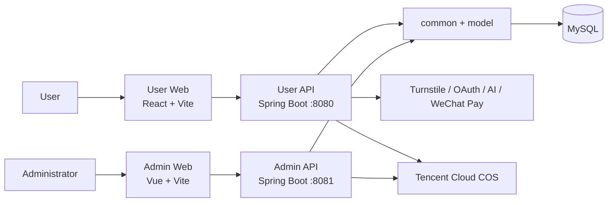

# HomeWork System Design

## 1. Project Overview

HomeWork is a web platform for question bank learning and examination preparation.

The core functions of the system are:

1. Users register, log in, and choose interview question banks or professional certification question banks.
2. Users complete practice sessions or examinations, and manage their answers, incorrect questions, favorites, and notes.
3. Administrators manage question banks, questions, and publication status through the administration system.

The Hit community, private messaging, public user profiles, learning calendar, and membership services are provided to improve the learning experience. The administration dashboard, user management, membership management, and audit logs support platform operations.

---

## 2. User Roles and Main Functions

### 2.1 Users

- Register and log in with email. Third-party OAuth integration is reserved in the application.
- Browse the home page, interview question banks, and certification question banks.
- Answer interview questions and receive AI feedback and reference answers.
- Complete certification practice sessions and formal examinations with automatic grading and result review.
- Manage incorrect questions, favorites, notes, and learning history.
- Publish Hit posts, comment, interact with other users, follow users, and send private messages.
- Purchase Premium or Premium Plus memberships and view membership status and order history.

### 2.2 Administrators

- Activate an administrator account through an invitation and log in to the administration system.
- Create, edit, publish, unpublish, and delete question banks.
- Manage questions, images, display order, and publication status within question banks.
- Import questions in batches using Excel with pre-validation.
- Manage users, community content, membership plans, administrator permissions, and audit logs.

---

## 3. System Architecture



The user API and the administration API are implemented as two independent applications. They share the same domain model, common response structure, JWT utilities, and business database.

User tokens and administrator tokens are isolated from each other. Administrator APIs cannot be accessed using user tokens, and user APIs cannot be accessed using administrator tokens.

---

## 4. Project Structure

| Directory               | Description                                                  |
| ----------------------- | ------------------------------------------------------------ |
| `frontend/web-app`      | React user application, routing, API client, and frontend tests |
| `frontend/web-admin`    | Vue administration application, permission routing, and management pages |
| `backend/common`        | Common response objects, exception handling, JWT utilities, password encoding, Tencent Cloud COS integration, and shared utilities |
| `backend/model`         | Domain entities and business enums                           |
| `backend/web/web-app`   | Controllers, services, mappers, and configuration for the user application |
| `backend/web/web-admin` | Controllers, services, mappers, and permission control for the administration application |
| `sql`                   | Database initialization and migration scripts                |
| `docs`                  | System design, API documentation, and supporting technical documents |

The frontend projects are managed through a pnpm workspace at the repository root. Backend modules are managed through the parent Maven project defined in `backend/pom.xml`.

---

## 5. Technology Stack

| Layer                   | Technologies                                                 |
| ----------------------- | ------------------------------------------------------------ |
| User Frontend           | React, TypeScript, React Router, TanStack Query, Tailwind CSS |
| Administration Frontend | Vue, TypeScript, Vue Router, Pinia, Element Plus             |
| Backend                 | Java, Spring Boot, MyBatis-Plus, MySQL                       |
| Authentication          | User JWT, Administrator JWT, Permission-based Authorization  |
| File Storage            | Tencent Cloud COS with temporary signed URLs                 |
| Payment                 | WeChat Native Payment with asynchronous server-side callback |
| Testing                 | Vitest, Testing Library, Playwright, JUnit, Maven            |

---

## 6. Core Business Design

### 6.1 Question Banks and Questions

Question banks are organized in the following hierarchy:

**Category Group → Module → Submodule → Question Bank → Question**

The system includes interview question banks and professional certification question banks. Content is maintained through the administration system, while the user application only accesses published content that the current user is authorized to view.

- Interview questions are primarily open-ended questions. After submission, the system returns AI feedback and reference answers.
- Certification questions support objective question types such as single-choice and multiple-choice questions, and can be completed in either practice mode or examination mode.
- Questions are associated with question banks through mapping relationships, and their display order is managed by the administration system.
- Question banks and questions follow a lifecycle including Draft, Published, and Offline states. All state transitions are validated by the backend.

### 6.2 Learning and Examinations

In practice mode, users submit answers question by question and receive explanations immediately.

In examination mode, the backend creates an examination session, stores temporary answers, controls session validity, and grades all answers when the examination is submitted.

After completing a question bank, the system records:

- Learning history and completion status
- Incorrect questions, favorites, and notes
- AI evaluations for interview questions
- Review data for the completed question bank

AI follow-up conversations reuse existing chat sessions for the same user and question bank, combining the current question, reference answer, and previous conversation history to generate subsequent responses.

### 6.3 Content Management

The administration system manages content at the question bank level.

1. Create a question bank and assign a category.
2. Create questions manually or import them through Excel with pre-validation.
3. Correct invalid data, adjust question order, and publish questions.
4. A question bank can only be published after it contains publishable questions.

Question images are uploaded to Tencent Cloud COS before being associated with questions.

Management operations are protected through permission checks, question bank data scope, optimistic locking (`version`), and operation reasons.

### 6.4 Community and Messaging

Hit is a lightweight community feature that supports publishing posts, comments, replies, likes, favorites, reposts, and mentioning users.

User interactions generate comments, interaction notifications, or system notifications.

Private messages are organized by Chatbox. Consecutive messages from unfamiliar users are restricted. Once users follow each other or receive replies, conversations can continue normally.

Public user profiles display basic user information and community activities.

The learning calendar, follow relationships, and unread message counts are supporting features.

### 6.5 Membership and Payment

The system provides two membership levels:

- Premium
- Premium Plus

Premium Plus includes all Premium benefits.

When a higher-level membership becomes effective, the remaining duration of the lower-level membership is frozen according to business rules.

The system supports both full-price purchases and eligible upgrade purchases.

Membership prices, eligibility, and validity periods are calculated by the backend. The frontend only submits the selected `planId`.

Membership orders use an `Idempotency-Key` to prevent duplicate order creation.

Membership benefits are granted only after the WeChat payment callback completes signature verification, decryption, and order validation. Client-side polling cannot grant membership benefits directly.

---

## 7. Main Business Workflows

### 7.1 User Learning

```text
Log in
    ↓
Browse Question Banks
    ↓
Start Practice / Examination
    ↓
Submit Answers
    ↓
Complete Question Bank
    ↓
Review Explanations
    ↓
Manage Incorrect Questions, Favorites, and Notes
    ↓
Future Review
```

### 7.2 Content Publishing

```text
Administrator Login
        ↓
Create Question Bank
        ↓
Create or Import Questions
        ↓
Validate and Adjust Order
        ↓
Publish Questions
        ↓
Publish Question Bank
        ↓
Available to Users
```

### 7.3 Membership Purchase

```text
Select Membership Plan
        ↓
Create Idempotent Order
        ↓
Display WeChat QR Code
        ↓
WeChat Callback
        ↓
Verify Signature and Update Order
        ↓
Grant Membership Benefits
        ↓
Client Polling Receives Success Status
```

---

## 8. Data Consistency

- MySQL stores user, question bank, question, answer, community, messaging, membership, and audit log data.
- MyBatis-Plus provides standard data access, while complex queries are implemented using Mapper XML.
- Business write operations are implemented in the Service layer. Controllers are responsible only for request handling and response generation.
- Editable administration resources use optimistic locking through the `version` field to prevent concurrent updates.
- Duplicate request protection is applied to membership orders, payment callbacks, import tasks, and state transition operations.
- Most deletions use business status changes or logical deletion. Operational records and payment history are retained.

---

## 9. Security

- `/api/app/**` uses user JWT authentication, except authentication endpoints.
- `/api/admin/**` uses administrator JWT authentication, except login and invitation endpoints.
- The administration system validates administrator status, permission codes, and accessible question bank scope.
- High-risk operations such as permanent user bans, membership revocation, membership plan changes, and administrator permission changes require one-time re-authentication tokens.
- Passwords, JWT secrets, payment keys, and COS credentials are loaded only from local configuration or deployment environment variables.
- Private question images are accessed through temporary signed URLs.
- WeChat payment callbacks require signature verification, payload decryption, and order amount validation.
- Registration and login requests can be protected by Cloudflare Turnstile.

---

## 10. Deployment

| Service                 | Default Address            | Description                                       |
| ----------------------- | -------------------------- | ------------------------------------------------- |
| User Frontend           | `http://127.0.0.1:5173`    | `/api` is proxied to the user API                 |
| Administration Frontend | `http://localhost:5174`    | `/api/admin` is proxied to the administration API |
| User API                | `http://127.0.0.1:8080`    | User-facing backend service                       |
| Administration API      | `http://localhost:8081`    | Administration backend service                    |
| MySQL                   | `127.0.0.1:3306/home_work` | Can be overridden through environment variables   |

In the production environment, the two frontend applications and the two Spring Boot services are deployed independently behind a reverse proxy that provides HTTPS, unified API routing, and CORS configuration.

